# Design Lineage and Aesthetic References

## The lineage, and why it guides us

Swiss-Function descends from a single tradition: the design of precision instruments and the graphic systems that document them. Dieter Rams and Braun; the Airbus glass cockpit and the disciplines of aviation display; Porsche and the automotive instrument cluster; the tactile "quality through precision of fit" of a Curta calculator, a Leica M3, a Hasselblad V, a Tektronix scope, a Moog patchbay; the Swiss grid of Muller-Brockmann, Vignelli and Gerstner; and their digital heirs from the DEC VT100 to the Bloomberg Terminal to Teenage Engineering. The same lineage extends into the machinery, electronics and industry that share this discipline: bench test and measurement instruments, control-room and machine-tool panels, audio and broadcast consoles, Olivetti and Italian rationalism, Bang and Olufsen under Jacob Jensen, and mechanical or segmented readouts. These objects were not styled to impress on first sight. They were engineered to be read correctly, under stress and fatigue, for tens of thousands of hours, and they still read correctly decades later. That is exactly the test our library sets itself: an interface for people who are reading and thinking for forty hours a week, judged by whether it would look out of place next to a 1960s Olivetti manual rather than by whether it looks novel this year. This document pulls out what actually transfers from these objects to a screen UI toolkit (grid, density, restraint, honesty of function, tactile feedback, legibility, colour as meaning, longevity) and, for every exemplar, states a concrete directive keyed to our tokens and components. It is the applied companion to [AESTHETICS.md](../AESTHETICS.md); read that for the stance, read this for the lineage that earns it.

---

## 1. Rams and Braun: "less, but better"

The founding discipline: subtraction, honesty of function, order through an invisible grid, and colour used as a functional code.

### Braun T3 pocket radio (1958, Dieter Rams with Hans Gugelot)

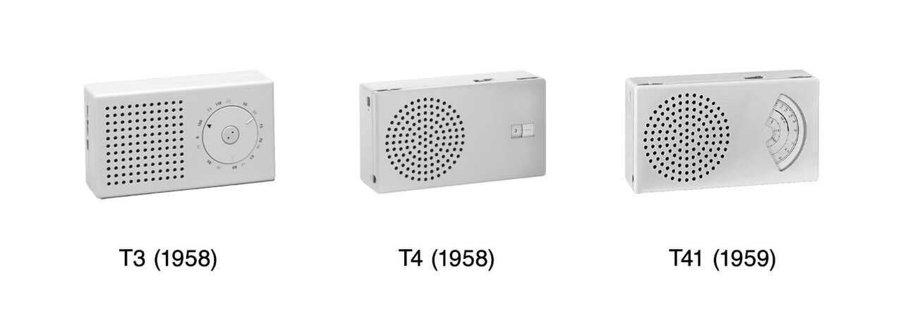 - CC BY-SA 4.0, photo PeterAjtony, Wikimedia Commons.

The face splits cleanly in two honest zones: a machine-drilled speaker grid on the left, one tuning dial with an engraved scale on the right. No decorative trim, no branding on the working face. The perforation grid is not ornament; it is the speaker, exposed and regularized. Function made visible becomes the only decoration the object needs.

**Rationale.** Rams reduced the radio to the two operations a pocket set actually needs, one thumbwheel to tune against an engraved scale and a separate volume wheel, and let the drilled speaker grid stand as the only surface texture. This buys immediate, unambiguous use and genuine pocket size. The cost is acoustic: early transistors and a single small speaker meant mono, low-fidelity output, modest sensitivity and only the MW and LW bands, so the object trades sound quality and range for portability and a control surface a hand can work without looking.

**Directive.** Split any control surface (a toolbar, a `DataTable` header, a `Pane.Header`) into an honest output region and a control region with one clean boundary, rather than scattering controls across the field. Let the working mechanism be the texture: a monospace numeric scale, a hairline grid, an aligned column of inputs. Derive texture from real data density (rows, ticks, digit cells), never from applied graphics.

### Braun ET66 pocket calculator (1987, Rams and Dietrich Lubs)

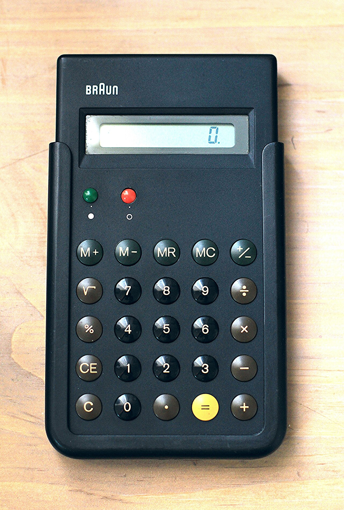 - CC BY-SA 2.0, photo Pinot Dita, Wikimedia Commons.

A near-monochrome field with a strict 5-column grid of keys. Colour encodes function only: numerals dark, operators a quiet warmer olive (a different class of key), and the single yellow "=" key marking the one action you commit with. That one warm key is the only saturated colour on the instrument. Restraint is what makes the accent legible.

**Rationale.** The ET66 encodes a key's job in a single channel: a near-monochrome field where dark numerals, olive operators and one yellow "=" separate three classes of key, with convex caps the finger locates by feel. Holding everything else neutral is what lets that one warm key read at a glance as the action you commit with. The cost is deliberate anonymity and no redundancy: the object carries no expressive identity, and the whole commit signal rests on one hue, so the scheme works only once the user has learned that yellow means equals.

**Directive.** Hold the interface monochrome and spend `--sf-color-primary` (or a semantic tone) only on the one action that commits or the one thing that is focused, exactly like the yellow "=". Never colour a control decoratively while it rests. Encode a second class of control (secondary vs primary) with a quiet tonal step rather than a second hue. Keep numerals in `--sf-font-mono` with tabular figures so `DigitInput`, `DataTable` cells and keypads align and scan like the ET66. This is already our rule; the ET66 is the image to cite in review.

### Braun SK4 Phonosuper, "Snow White's Coffin" (1956, Rams and Gugelot)

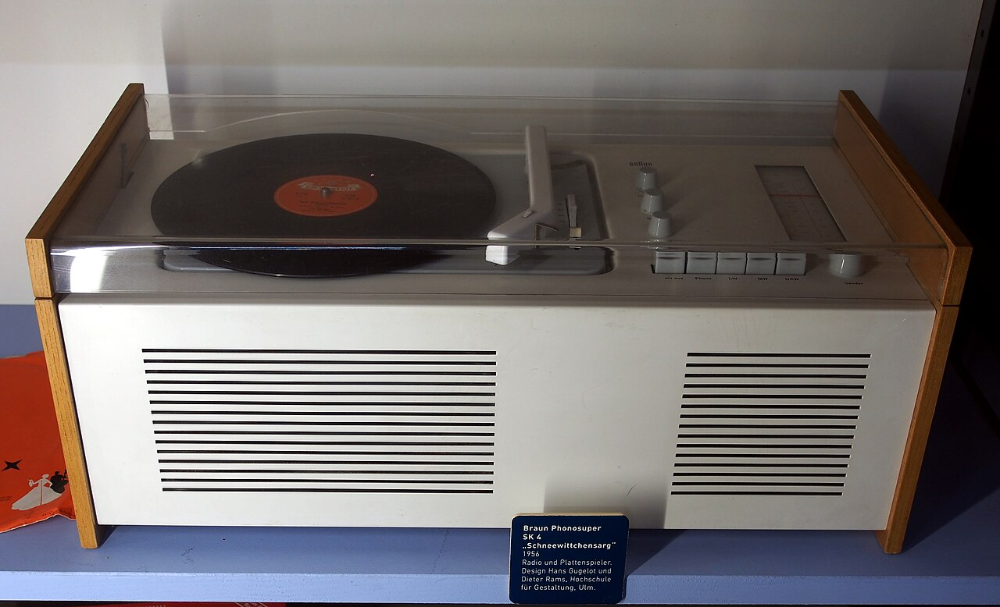 - CC0 public domain, photo Alf van Beem, Wikimedia Commons.

In a market of veneered cabinets with hinged lids, this arrived looking like lab equipment: a transparent Plexiglas lid that invites inspection of the platter instead of hiding it, all controls confined to one strip on the right, and a speaker grille that is just thin horizontal rules pressed into metal. The clear lid was an honesty move and an engineering one (metal rattled at volume). A hairline rule, repeated, is enough texture.

**Rationale.** The transparent Plexiglas lid was an honesty move and an engineering fix at once: it shows the platter and the machine's real state instead of hiding it, and it replaced a planned sheet-metal hood that rattled at volume. Confining every control to one right-hand strip leaves the rest of the object a calm working surface. The trade was the furniture idiom the 1950s market expected, the veneered cabinet that concealed the mechanism and read as status furniture, which is why the press coined "Snow White's Coffin" as a jibe; acrylic also scratches and yellows and protects less than wood. It accepts a colder, more exposed object in return for a truthful one.

**Directive.** Prefer transparency over friendly concealment: surface the real state and real data (a live count, the actual query, the raw value in an editable cell) rather than smoothing it behind summarized chrome. Corral controls into one honest strip (a single `Pane.Header` or toolbar), leaving the body a calm working surface. Build separation from repeated hairlines at `--sf-color-gridline` rather than from shadows or fills. Let one structural element carry any warmth; do not paint warmth on.

### 606 Universal Shelving System (1960, Rams for Vitsoe, still in production)

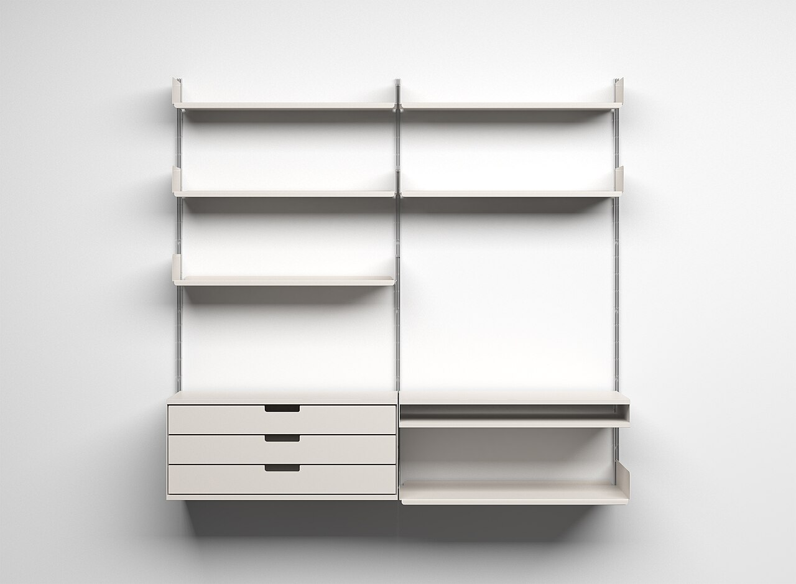 - CC BY-SA 3.0, photo Vitsoe, Wikimedia Commons.

A tiny kit of parts hung from wall tracks, recombining into endless configurations, all snapped to one vertical grid: asymmetric in arrangement, rigid in alignment. A shelf bought today still fits a rail from 1960. Order comes from the grid, which frees the arrangement to be content-driven without ever looking messy. Longevity is designed in: adaptable, repairable, deliberately un-fashionable.

**Rationale.** A small kit of parts hangs from wall-fixed E-Tracks on one shared vertical grid, recombining without limit and held rigorously backward- and forward-compatible, so a rail from 1960 still takes a shelf bought today. It optimizes for adaptability and multi-decade life: reconfigure and repair rather than replace. The cost is paid up front and in commitment, since the original system had to be fixed into a solid wall (only later relaxed by a free-standing foot), and the made-to-order craftsmanship and slow "descent with modification" discipline make it expensive and deliberately un-fashionable. It gives up the appeal of a finished statement piece to stay a system that never dates.

**Directive.** Treat the toolkit itself as a 606 kit of parts on one shared grid: every gap, height and inset a multiple of `--sf-unit` snapped to the baseline, so `Grid`, `FieldLayout` and `Pane` compositions align like shelves on a rail however they are arranged. Let layout be asymmetric and content-driven while alignment stays rigid (the `FieldLayout` left-to-right fill is exactly this). Guard backward compatibility as a feature: extend with props and tokens, never fork, so a screen built on an old version still hangs on the rail. Choose the un-fashionable long-life default (2px corners, system font, no trend styling) precisely so the interface does not date.

---

## 2. Aviation cockpits: colour as a reserved channel, lit by exception

High-trust displays that a trained eye reads at a glance, under glare and fatigue. A central lesson in the lineage about colour discipline and spatial constancy.

### Airbus Primary Flight Display and Flight Mode Annunciator (1982 to present)

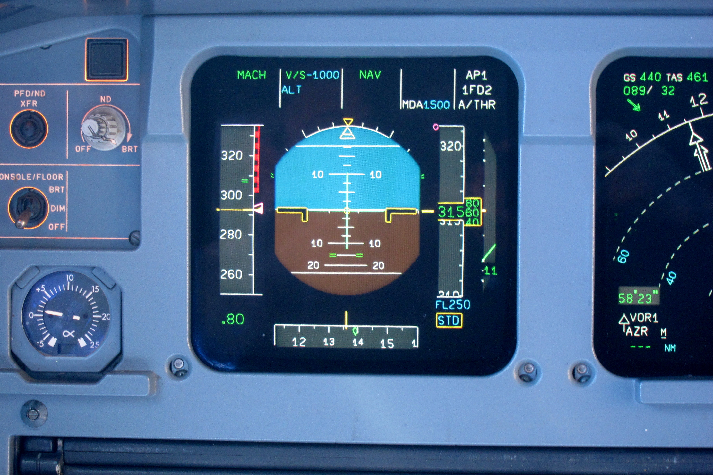 - CC0 1.0, photo Olivier Cleynen.

A near-monochrome screen where every saturated pixel is answerable to a state: green engaged, cyan armed, amber attention, red hazard or limit. The live altitude is boxed and holds its pixel position while the scale scrolls behind it. A fixed header strip (the FMA) always names the active mode in words plus one colour, and never moves.

**Rationale.** Colour is treated as a scarce signalling channel so that under glare and fatigue a saturated pixel always means a state (green engaged, cyan armed, amber caution, red hazard), and the Flight Mode Annunciator names the active mode in words as well as colour so a dazzled or colour-blind eye still reads it. The cost is that colour can then do no other work: grouping, emphasis and decoration all fall to position, size and type, and the display stays deliberately austere. The permanent mode strip also spends fixed screen area on text that rarely changes, paying continuously so the crew never has to hunt for what the automation is doing.

**Directive.** Give every live numeric readout (`DigitInput`, `DataTable` metric cells, KPI tiles) a fixed-width box with tabular monospace numerals so digits never reflow as they change; let the scale or trend move, never the number. Keep colour strictly semantic: a resting control is neutral (`--sf-color-border`, `--sf-color-fg`), and `--sf-color-primary` / `-success` / `-warning` / `-danger` appear only to mark a genuine state or limit. Provide a persistent status strip in a fixed `Pane.Header` slot that spells out the current mode in words plus one colour, and never reorders it.

### ECAM and the dark cockpit (1983 to present)

 - CC BY 2.0, photo Steve Jurvetson.

The overhead panel sits dark under normal operation; a fault lights a single button and posts a colour-tiered message. Severity is two tiers that never collapse into one alert: red master WARNING (immediate action, steady light, continuous chime) versus amber master CAUTION (awareness, single chime). Each alert is paired with the corrective action, so the display tells you what to do rather than just that something is wrong.

**Rationale.** A resting dark panel makes "nothing is lit" mean "nothing is wrong," so any illuminated element is by definition worth acting on, and severity is capped at two tiers that never merge so the crew never grades an alert mid-emergency. The design buys a quiet field and low workload, but it forces the operator to trust the absence of light: a failed indicator reads identically to a healthy system, which is why a lamp test is mandatory and still cannot catch a bulb that dies after it. Two tiers also refuse nuance, forcing every intermediate condition up or down, and pairing each alert with its scripted procedure can lead crews to run the checklist rather than understand the aircraft (the reliance criticism raised after Nagoya and AF447).

**Directive.** Make the resting UI genuinely quiet: no colour, no badges, no notification dots when nothing is wrong (our "no engagement signifiers" rule as an instrument principle). Reserve exactly two alert tiers and keep them distinct: `--sf-color-warning` for an awareness caution (persists, does not interrupt) and `--sf-color-danger` for an action-required hazard (stronger, may interrupt); never a third decorative alert colour. Pair every error or warning with the concrete next action, and route both through `NonIdealState` or a status region rather than scattering them.

### MCDU / FMS data-entry unit and the scratchpad (late 1980s to present)

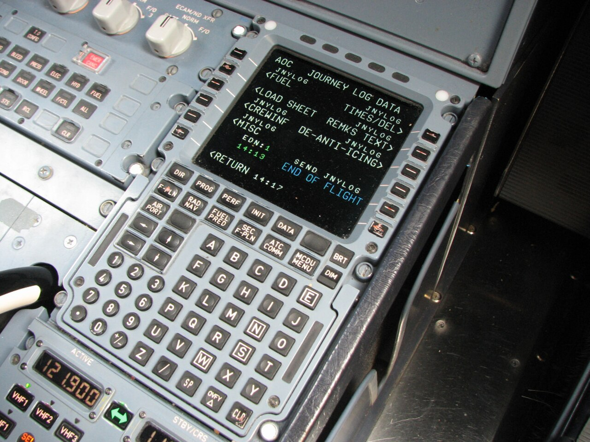 - Public domain, photo Christoph Paulus.

A fixed 14 by 24 monospace screen, two columns of labelled fields, each flanked by a line-select key so the label sits right beside the control that acts on it. Input is typed into one scratchpad line at the bottom, then committed into a chosen field with a single deliberate press. Edits are staged, previewable and reversible before they take effect.

**Rationale.** Staging every entry in one scratchpad line and committing it to a field only on a deliberate line-select press keeps an edit previewable and reversible before it reaches a live flight plan, optimising for a guarded commit over speed. The price is keystrokes: the type-then-select flow is slower than typing straight into a field, and only one value is in flight at a time. The fixed 14 by 24 monospace grid also caps how much is visible at once, trading an at-a-glance overview for a small, cheap, glare-proof screen the crew pages through.

**Directive.** In forms use the `Field` compound so the label sits immediately adjacent to its control (never a distant floating legend), and lay whole forms out with `FieldLayout` so fields hold strict source order on a fixed grid. For dense inline editing (`DataTable` cells, a command bar), stage the pending edit in one consistent location and commit on an explicit action (the scratchpad-then-line-select pattern) so a value is previewed before it takes effect. Keep entered and tabular data in `--sf-font-mono` with `font-size-adjust: var(--sf-font-mono-adjust)`, and reserve amber (`--sf-color-warning`) purely for a genuine input problem.

### The glass flight deck as a fixed-layout workplace (1988 to present)

 - CC BY-SA 2.5, photo Ralf Roletschek.

Six identical-format screens in a permanent grid; nothing moves house between flights. The Navigation Display is a dark scan showing only the route arc, range rings and traffic that matter now. Spatial constancy means recognition replaces search, and cross-crew training transfers directly. The layout is judged by decades of fatigue-free use rather than by novelty.

**Rationale.** Freezing every screen's format and position means recognition replaces search and training transfers directly between crews and airframes, and the Navigation Display earns its calm by drawing only the route arc, range rings and traffic that matter now. That constancy is bought by stripping out per-pilot configurability, so the layout cannot adapt to one operator's preference or an unusual task. Filtering to "what matters now" also asks the crew to trust the automation's picture, and the wider move to glass traded hands-on manual proficiency for monitoring, raising automation complacency and mode confusion when the system does the flying.

**Directive.** Assign each region of an app a permanent home with `Pane` / `Grid` and do not reflow or reorder critical information on state change; a `DataTable` column, a status strip and a detail pane should be where the user last left their eyes. Follow the Navigation Display in charts: default to `scaffolding="hover"` so gridlines and axes stay quiet (`--sf-color-gridline`) and the data marks carry the ink, adding scale only when density demands it. Strip anything competing with the data and add back only what proves necessary.

---

## 3. Automotive instruments: rank by decision-value, one colour for one threshold

Porsche instrument clusters: a matte field that recedes so only the data is lit, typographic hierarchy rendered in metal and paint, and layout treated as a decades-long contract.

### Porsche 356 A cockpit: the centrally placed tachometer (1955 to 1959)

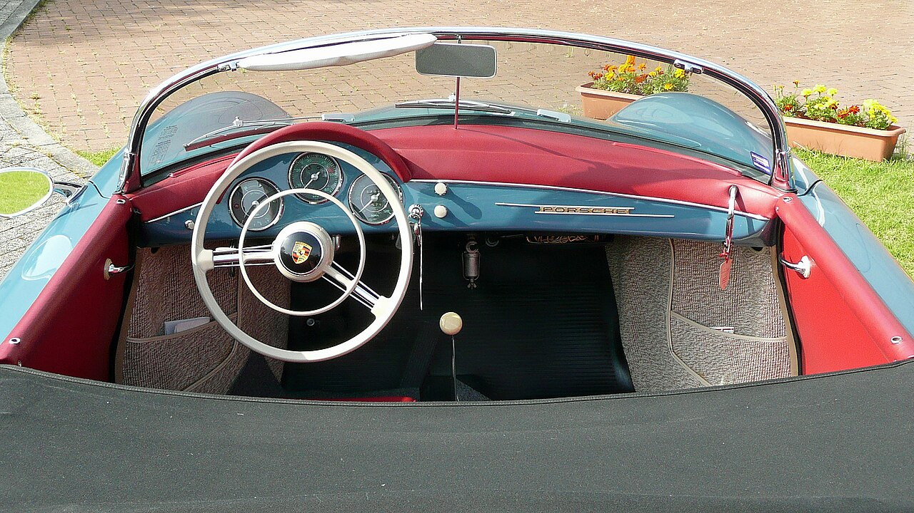 - CC BY-SA 3.0, photo PekePON, Wikimedia Commons.

Porsche put the tachometer dead centre and dominant, on the stated reasoning that exact speed is secondary (a racer drives as fast as possible anyway) while rpm governs the shift point and protects the engine. Hierarchy by importance rather than convention. A complete driver surface is built from only three instruments, each present because a real decision needs it.

**Rationale.** The layout ranks instruments by decision-value: rpm governs the shift point and protects the engine, so it earns the optical centre and the largest face, while exact speed is demoted on the reasoning that a racer drives flat-out regardless. This optimises for the one number a driver acts on continuously and refuses to front-load a figure just because convention expects it. The cost is that the premise only holds on a track. On the road the speedometer is the reading the law cares about, and demoting it to a subordinate slot makes the everyday number the harder one to catch at a glance.

**Directive.** In a dense readout or dashboard, put the metric the user acts on in the optical centre and give it the largest type, even when convention would front-load a different number. Use `Grid` to reserve one fixed central primary-readout slot with smaller `sm`-sized satellites around it; rank tiles by decision-value and refuse to make every KPI the same size. Add a readout only when a real decision needs it.

### Air-cooled Porsche 911 five-gauge cluster, VDO (1963 onward)

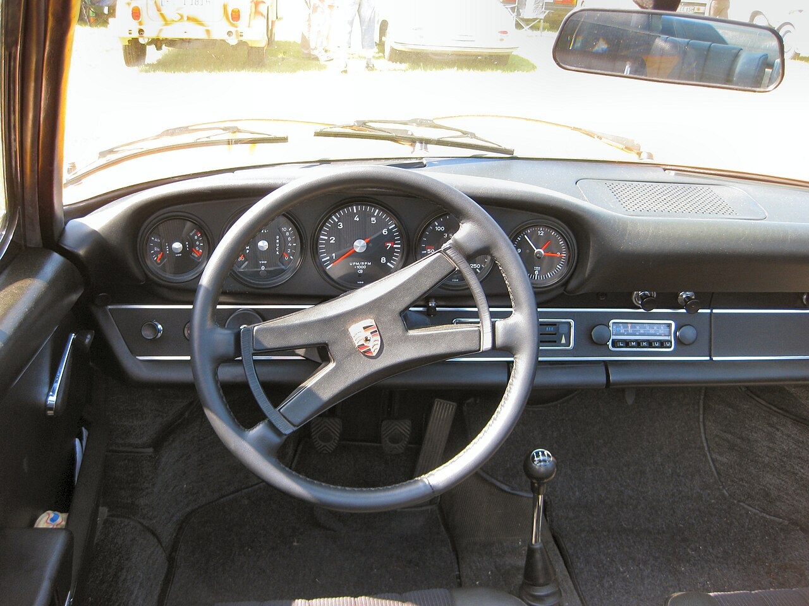 - CC BY-SA 3.0, photo KarleHorn, Wikimedia Commons.

A fixed symmetrical fan of graduated dials with one dominant member, matte black faces so the only bright things are needles and numbers, and a single saturated colour (red) reserved strictly for the redline threshold. Nothing decorative survives.

**Rationale.** The cluster is a fixed symmetric fan with one dominant dial, matte black faces so only needles and numerals catch light, and red spent strictly on the redline. It optimises for instant recognition and fatigue-free legibility: the eye learns one arrangement and reads it by position for decades. The price is packing five overlapping dials into one tight fan, which pushes the outer two (fuel, clock, oil) partly behind the steering-wheel rim, so the least-critical readings become the hardest to see. The rigid symmetric layout also cannot reflow to relieve that, a flaw Porsche only resolved once the dials went digital in the 992.2.

**Directive.** Build stat and metric clusters as a fixed, ordered grid with one dominant tile and equal-weight satellites; keep the ground neutral (`--sf-color-bg`, near-black in dark mode) and let only the values carry contrast. Reserve saturated colour (`--sf-color-danger`) for an actual threshold crossing, never for decoration, and use tabular numerals wherever a number can change. This is typographic hierarchy rather than colour hierarchy, rendered in dials.

### Porsche 997 central tachometer with warning tell-tales (2004 to 2012)

 - CC BY-SA 2.5, Wikimedia Commons.

Status tell-tales hold fixed, learnable positions but render nothing until their condition is true, so nothing competes for attention until its condition holds. And the gauge dual-encodes: an analog sweep for the instantaneous rate, a small digital inset for the exact figure, both inside one instrument. Ticks stay crisp and fixed; only the needle moves.

**Rationale.** Status tell-tales hold fixed, learnable positions but stay dark until their condition is true, and the tachometer dual-encodes by pairing the analog needle for the instantaneous read with a small digital inset for the exact figure (the 997 restored that inset to the tach face after the 996 facelift wrongly buried digital speed in the odometer). It optimises for a calm face that lights only on a real event and for getting both a trend and an exact number from one instrument. The cost is real estate and redundancy: the lamp bank reserves face area that sits blank almost all the time, and carrying two readouts for one instrument adds complexity a single mode would avoid.

**Directive.** Give status indicators reserved, stable slots but render nothing (or the quietest neutral) until the state is real: no notification dots, no decorative new-badges. When a value needs both a quick trend read and an exact figure, pair a sparkline or a `Spinner`-style glyph with a tabular numeric readout instead of choosing one. Keep chrome (ticks, rules, cell edges) crisp and pixel-snapped while the moving mark stays anti-aliased.

### Porsche 997 five-gauge cluster through the wheel (2004 to 2012)

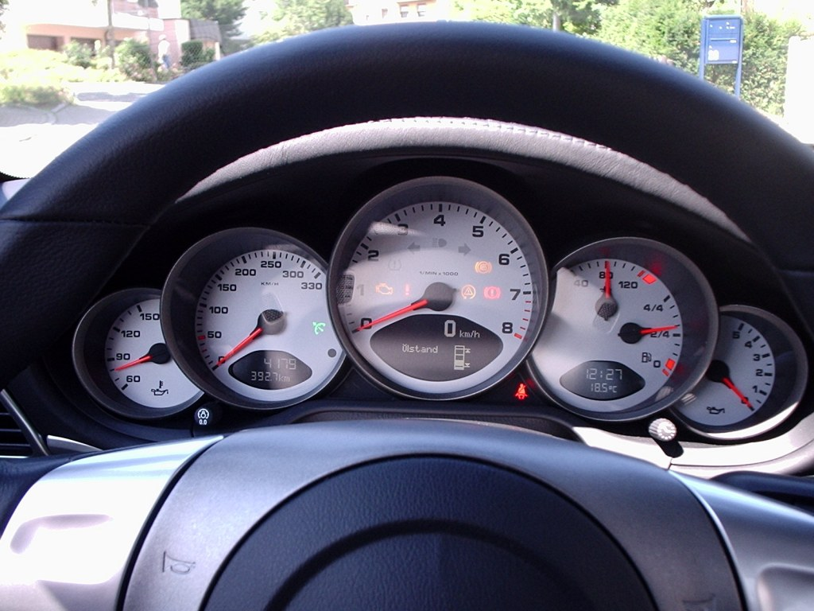 - CC BY-SA 2.5, photo Cerafino, Wikimedia Commons.

Forty years on, the layout is unchanged: still tachometer-centred and largest, but new digital data (odometer, clock, temperature) was folded into the existing dials rather than bolted on as a new panel. Porsche kept the cluster only lightly configurable, on the record, to protect the driver's spatial memory. Consistency is treated as a feature you do not spend lightly.

**Rationale.** The layout is held fixed for forty years to protect the driver's spatial memory, new digital data is folded into the existing dials rather than bolted on as a panel, and configurability is deliberately withheld. It optimises for muscle-memory transfer, so a driver stepping between models finds every instrument where the last one kept it. The trade-off is that freezing the layout also freezes its faults: the outer dials stay partly hidden behind the wheel rim, and refusing per-driver configuration means the cluster cannot be tuned to an individual or a task. Consistency is bought at the price of adaptability, and even retaining the analog tach at all became a hard internal argument as digital clusters arrived.

**Directive.** When adding features to a dense tool, fit them into established layout slots instead of reflowing the surface, and keep component positions stable across versions so muscle memory survives. Absorb new data into an existing readout (an inline value inside a tile) rather than adding a panel, and resist configurability that fragments a shared layout. This backs our fixed token grid and stable-chrome stance.

---

## 4. Mechanical precision: one locus and one gesture, group by zoning rather than boxes

Instruments that read as high quality because of the fit and the decisive detent of each control rather than any ornament. The cluster that most directly licenses our tactile-feedback vocabulary.

### Curta mechanical calculator (1948 to 1970, Curt Herzstark)

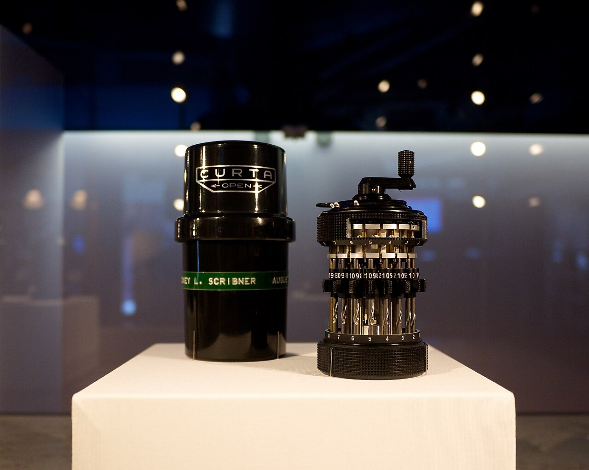 - CC BY 2.0, Wikimedia Commons / Computer History Museum.

The whole interaction concentrates in one input locus: the crank is the only submit. Subtraction is not a far-away button but the same crank entered with a small pull-first gesture. State is engraved and always visible in the register; quality is communicated entirely through precision of fit and the decisive click of each turn.

**Rationale.** Herzstark folded subtraction into the same stepped drum through nine's-complement arithmetic, so a single cylinder replaced the ten or so drums of a desktop machine and let the whole calculator collapse onto one crank and one always-visible register. That bought pocket size and one-handed universality (add, subtract, multiply and divide from one gesture) at the cost of speed: the single serial locus means multiplying by 1024 takes seven crank turns plus carriage shifts, each sequenced by the user's own procedure. The miniaturised single-drum mechanism also runs to roughly 600 precision parts, which made it expensive (about $125 in 1970 against $10 to $50 for a slide rule) and hard to assemble or repair. It trades throughput and manufacturability for compactness and the honesty of one visible locus.

**Directive.** Give a dense entry control one primary action locus and express its secondary mode as a modifier on that same gesture, never as a distant toggle. In `DigitInput` / `DigitInputMicro` keep the calculator "push" feel where digits commit decisively into fixed, always-visible tabular-numeral cells (never placeholder text that vanishes); reserve `--sf-ease-snap` for that single committing keystroke so the value seats like a detent. Show current state permanently in engraved monospace rather than revealing it on hover.

### Hewlett-Packard HP-35 scientific calculator (1972)

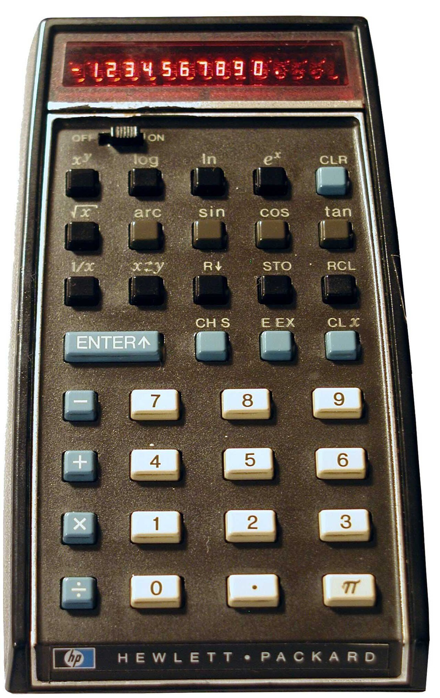 - CC BY-SA 3.0, Wikimedia Commons.

A crowded 35-key panel zoned by weight, size, spacing and a single accent rather than by boxes. The most important action (ENTER, the stack push) is the largest and most saturated key, so the hand finds it without reading. Legends were molded through the plastic so they could never wear off.

**Rationale.** Because RPN routes every calculation through the stack push, HP made ENTER the largest and highest-contrast key and zoned the other 34 by weight, size and contrast rather than boxes, so the hand learns the panel by feel. This optimises keystroke efficiency (no parentheses, no equals, intermediate results always shown) and, via two-shot moulding that runs the legends through the key, durability that outlasts decades of use. The cost is first-use familiarity: RPN imposes a four-level-stack mental model that is alien to anyone taught algebraic notation, and that fixed stack overflows on any expression needing more than four pending values. Moulded-through legends likewise cost more to make than printed ones, so the HP-35 buys expert speed and permanence at the price of an initial learning curve and manufacturing expense.

**Directive.** Zone a control cluster (a toolbar, a `ButtonGroup`, a form's action row) by typographic weight, key size, whitespace and exactly one accent (`--sf-color-primary` on the single primary `Button`), never by boxing every group in borders. The primary action is visually the largest and most saturated element; everything else is neutral. Keep legends full-strength and always present (never grey, never hover-only) so the affordance never wears off.

### Tektronix 465B analog oscilloscope front panel (mid-1970s)

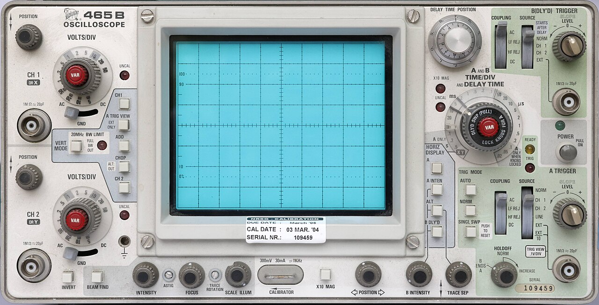 - CC BY-SA 4.0, Wikimedia Commons.

A high-density panel kept legible by dividing it into labelled functional regions separated by a faint background tint, rule lines and space rather than heavy borders. Red center knobs mean one specific thing (you are off calibration). A coarse control nests its fine adjustment concentrically, in the same place. Small-caps labels and quiet gridlines keep scaffolding behind the data.

**Rationale.** The panel gives one dedicated physical control per function, grouped into vertical, horizontal and trigger zones cued by tint, rule and space, with coarse and fine nested concentrically and colour spent only on a real condition (the red VAR detent warning that the reading is no longer calibrated). This optimises direct, modeless operation: every parameter is one reach away and its setting is legible at a glance, which kept the layout an industry reference for years. The cost is that one-knob-per-function does not scale; each feature consumes irreplaceable panel area and per-knob mechanical cost, so the instrument is large and cannot grow without more knobs, and it predates menus precisely because it refuses the compression a shared, moded control would buy. Concentric knobs recover some space but couple two adjustments onto one shaft, so glance-legibility and immediacy are paid for in area, cost and a fixed feature set.

**Directive.** Zone dense surfaces (a `Box` or `Pane` full of controls, a `DataTable` toolbar, a chart's control cluster) into labelled regions cued by a faint tint or a single `--sf-color-border` rule and spacing on the `--sf-unit` grid rather than by nesting boxed cards. Reserve semantic colour for genuine state: a red ring or marker means "this value is out of range," echoing the red VAR knob. Keep a coarse-plus-fine pair together (a stepped value with an inline nudge), and keep gridlines and axis chrome on `--sf-color-gridline`, quieter than structural borders.

### Moog modular synthesizer patchbay (1960s to 1970s)

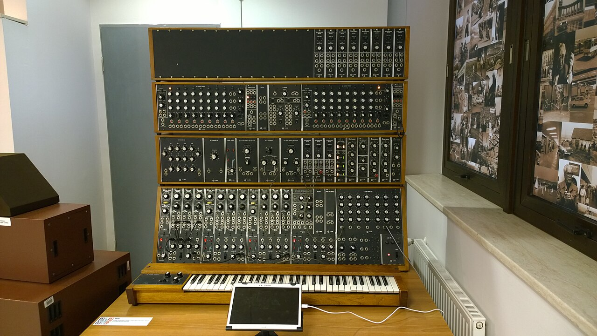 - CC BY-SA 4.0, Wikimedia Commons.

A wall of modules, every one a uniform-width strip with an identical internal layout (label top, controls middle, patch jacks bottom). Density is high but legible because the grid of identical modules teaches the eye one layout it reuses everywhere. Patch cords make the signal routing physically visible and hand-editable.

**Rationale.** Every module is a uniform-width strip sharing one internal template (label top, controls middle, jacks bottom), and every signal route is exposed as a physical patch cord, so the eye learns one layout it reuses across the wall and the signal path stays visible and hand-editable. This optimises a learn-once grid and total routing freedom, but a patch carries no memory: there is no preset recall, so a sound lasts only while the cables stay in place and otherwise must be rebuilt from a written patch diagram. Cords are also slow to set up and tangle into a spaghetti of overlapping runs, and the fully modular grid pays in size, cost and the normalisation compromises Moog added to tame it. That visibility and flexibility cost recall, speed and portability, the gap the hardwired Minimoog later addressed.

**Directive.** Compose dense tool surfaces as a uniform `Grid` of modules that share one internal template (label top, controls middle, inputs and outputs bottom) aligned to `--sf-unit` tracks, so scanning is learned once. When elements connect, draw the connection explicitly: use `Graph`'s visible, editable edges or a rendered line rather than burying the relationship in a config panel. Favour a stable left-to-right, top-to-bottom flow so the eye follows the pipeline.

---

## 5. Cameras: only what is needed, labels engraved into the material, honest seams

Leica and Hasselblad: control density stripped to the task, labels cut into the material, modular bodies that snap together at legible joints and report their own state.

### Leica M3 top plate (1954, Ernst Leitz Wetzlar)

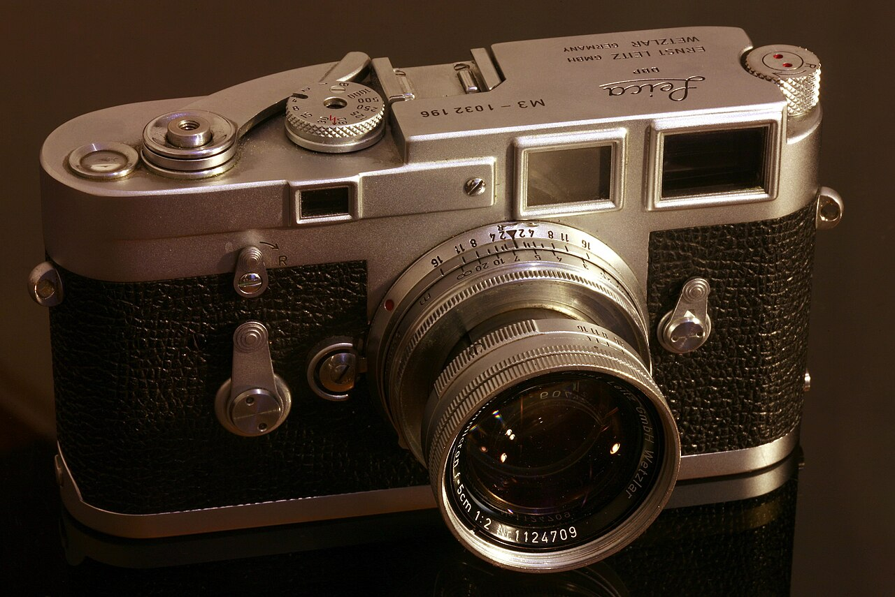 - CC BY-SA 2.0 FR (dual CeCILL), author Rama, Wikimedia Commons.

The top plate carries only what shooting needs: no mode dial, no scene selector, no branding beyond a maker's mark. Each control earns its footprint and handles one job. Labels are cut into the metal, permanent and monochrome, so hierarchy comes from position, size and rule, never colour. The one combined shutter dial consolidates a whole decision onto a single detented control. Colour appears exactly once, as a red index dot.

**Rationale.** Each control consolidates a whole decision so the camera runs fast and by feel: the single non-rotating shutter dial merged the separate fast and slow dials of the earlier screw-mount Leicas onto one detented control, and the 0.91x combined rangefinder/viewfinder window was tuned for critical focus with a 50mm lens. The cost of that stripping is real. The M3 carries no light meter, so exposure depends on a separate instrument, and the high-magnification finder physically cannot fit framelines wider than 50mm, so 35mm and 28mm users lose native framing. Building to this tolerance by hand also priced it roughly 50% above the already costly Leica III.

**Directive.** Strip component chrome to the controls the task actually needs and treat a finished-looking blank surface as done rather than empty. Render labels and values in `--sf-font-mono` at full strength (`--sf-color-fg`, with `font-size-adjust: var(--sf-font-mono-adjust)`), single weight, grid-aligned, carrying hierarchy through position and rule lines rather than colour. Spend `--sf-color-primary` like the red index dot: once, only to mark the active or focused state. Prefer one consolidated control (a single `ToggleGroup`, one dial-like stepper, one `Picker`) over several scattered toggles for a single decision.

### Leica M3, low-key study (same body, rim-lit against black)

 - CC BY-SA 2.0 FR (dual CeCILL), author Rama, Wikimedia Commons.

The camera does not need even lighting to be legible: the eye finds the controls from a few crisp specular highlights on the working parts while everything non-functional recedes into near-black. This is a direct model for an honest dark theme, where near-black is the field and the interactive edges catch the light rather than every surface being lifted by a soft glow.

**Rationale.** The finish does the work of lighting: chrome-plated brass plates take a bright satin sheen on the dials and levers while the matte vulcanite covering absorbs light and supplies grip, so the working parts catch the eye under any light and the flat panels recede. This optimises for controls that stay legible in poor light and a body that is secure in the hand. The trade is weight and discretion. Chrome over brass is dense (about 580 g for the body alone) and the bright plating is conspicuous and reflective, which is why Leica later sold a black-paint version so photojournalists could work unseen, and that paint in turn wore back to brass.

**Directive.** Build dark mode the way this body reads at rest: let near-black be the field and let only the working edges catch light. This is exactly our `[data-theme="dark"]` elevation model (a brutalist zero-blur hard cast in the border colour, a faint lightening film only above elevation 1, and a 1px lit inset rim that brightens with level): lean on those lit edges to define controls instead of raising surface backgrounds or adding glow. Reserve the specular-highlight brightness for interactive and focused elements; keep resting chrome quiet so the active control is the thing that catches the eye.

### Hasselblad 500 C/M, profile (500C 1957, C/M from 1970)

 - CC BY-SA 4.0, author Christopher Crouzet, Wikimedia Commons.

Body, film back, finder and lens are separate parts, each swappable, each doing one job, each joined at a legible bright seam. A module carries its own always-visible status readout: the film back shows "12" frames and a film-type reminder, so the system reports its own state without a screen. The leaf shutter in the lens is what makes lens and body cleanly separable: a clean interface between parts.

**Rationale.** After the focal-plane 1000F's reliability problems, Hasselblad rebuilt the camera as separable modules, each doing one job and reporting its own state at a clean bright seam. Moving the shutter into each lens (the Compur leaf shutter) is what let body, back, finder and lens part at legible interfaces, and it bought flash synchronisation at every speed plus mid-roll back swaps. The cost is that a shutter in every lens makes each lens more complex and expensive, caps the top speed at 1/500, and the interlocks that keep the modules in step impose a strict cocking sequence that jams the camera if the operator breaks it.

**Directive.** Compose interfaces from distinct modules, each owning one job, separated by exactly one structural border (`--sf-color-border`), keeping the seam legible rather than dissolving panels into each other (use elevation and spacing rather than a second lighter line). This is the compound-component grammar we already have: `Pane.Header` over `Pane.Body`, `Dialog.Root` / `Handle` / `Body`, `WindowArray` columns, a `DataTable` whose swappable data is the film back. Give each module a small, always-visible status readout of its own state (a `Chip` with a `dot`, a frame counter), engraved-quiet in mono, never a notification badge.

### Hasselblad 500C with Carl Zeiss Planar lens, three-quarter front (1957)

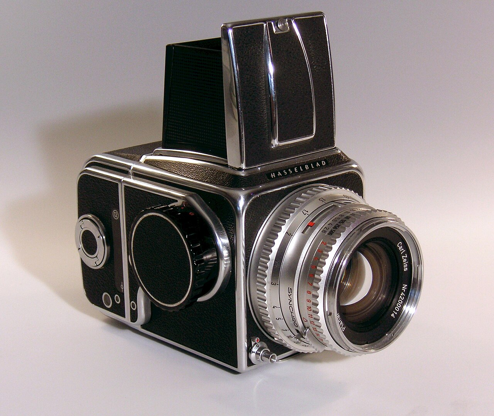 - Public domain, author Holger Ellgaard, Wikimedia Commons.

Every coupled exposure parameter (shutter, aperture, EV, focus) is stacked coaxially on one barrel, so the whole exposure state reads in a single glance and adjacent rings turn without the hand moving. Two engraving colours separate two coupled scales without clutter. The body is a hard rectilinear cube whose only softening is a hairline radius on the chrome corner rails: sharp everywhere, radiused only where a hand grips it.

**Rationale.** Stacking the coupled exposure parameters coaxially on one barrel lets the whole state read and adjust with one hand and one glance: the shutter and aperture rings interlock on a chosen exposure value, so the photographer can trade speed for aperture without changing the exposure, and two engraving colours keep the two scales legible without clutter. It optimises for holding a metered EV while re-splitting speed and aperture by feel. The same interlock is the cost: moving one ring alone requires pulling a release tab, an extra deliberate gesture that split users into camps, and the dense coaxial stack asks the hand to learn which ring is which before the camera becomes quick.

**Directive.** Co-locate and co-align coupled parameters so their combined state reads in one glance: use `FieldLayout` rigid and flexible rows and mono tabular figures so adjacent related fields line up on the baseline grid and the whole state is one read rather than a hunt across a form. Keep the rectilinear body sharp: honour `--sf-radius-default` at 2px as the chrome corner rail, a slight rounding for grip, and resist any pull toward 8 to 16px softening. Where two coupled scales share a control, distinguish them by one restrained means (mono weight, a rule, or the single `--sf-color-primary` index), never a rainbow.

---

## 6. The Swiss grid: design the programme rather than the page

Muller-Brockmann, Vignelli and Gerstner: the grid as an invisible source of order, hierarchy from scale and space rather than colour, and identity from a single strong invariant that absorbs wide content variety.

### Josef Muller-Brockmann, Beethoven Tonhalle poster (1955, Zurich)

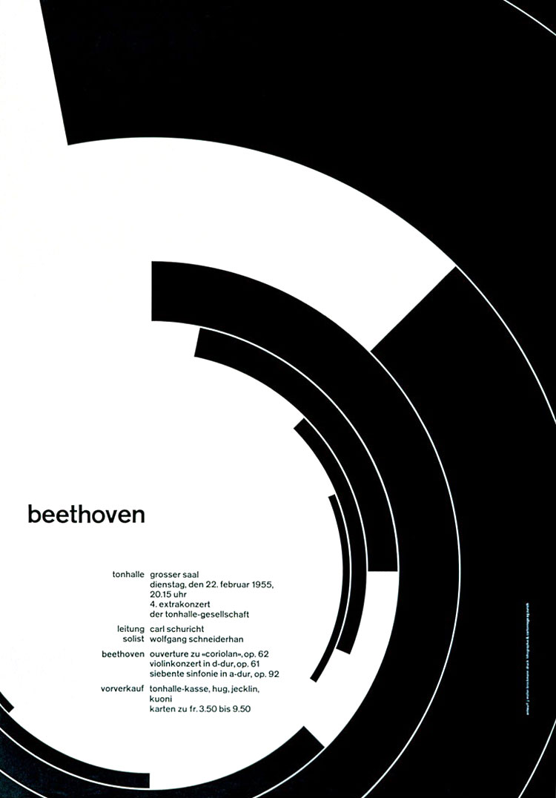 - CC BY-SA 4.0, Wikimedia Commons.

One dominant rule-driven graphic idea (rhythm as concentric arcs on a fixed angular module) does all the expressive work, with no colour and almost no help from type size, beside a tiny disciplined credit block set as label/value pairs: a narrow left column of labels aligned to a common right edge, a wider value column flush-left. Alignment alone supplies the structure.

**Rationale.** The principle is that one rule-driven idea can carry all the expression: the concentric arcs sit on a fixed 11.25-degree angular module with widths doubling 1, 2, 4, 8, 16, so the geometry itself stands in for musical rhythm and dynamics without colour or varied type. This optimises for immediate emotional legibility and total formal unity from a single invariant. The cost is descriptive content: the poster communicates mood and drama but almost nothing literal, and the whole thing rests on that one abstract system reading correctly, with the small credit block left to carry every fact.

**Directive.** Set every metadata block (a `Field` row group, a key/value `DataTable`, a definition list, a chart caption cluster) exactly like this credit block: a narrow left column of labels aligned to a shared right edge, a wider value column flush-left, both at `--sf-font-size-sm`, one `--sf-unit` of leading between rows, no rules or dividers or colour. Let alignment be the structure. When one element must lead a view (a hero metric, a `NonIdealState` message, a chart), make it dominate by scale and by the silence around it, keeping every supporting label small and gridded.

### Josef Muller-Brockmann, der Film exhibition poster (1960, Zurich)

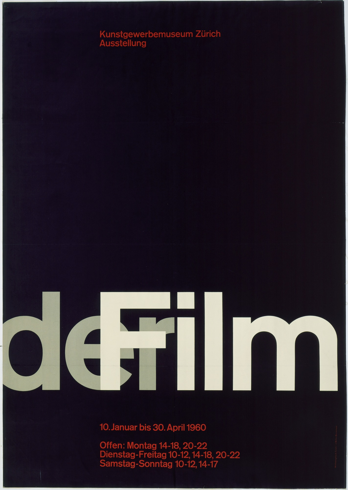 - Public domain, Wikimedia Commons.

The oversized title is built on the same modular squares that structure the page, so the image is made of type rather than dropped onto it. The one accent, red, is reserved strictly for functional text (institution, dates, a tabular opening-hours block), while the big graphic element stays neutral. Large negative space is a held choice governed by the grid rather than filler.

**Rationale.** The design builds the oversized title from the same 15 modular squares (a 3 by 5 golden-mean rectangle) that structure the page, so the image is made of type and the large black negative space is a held grid decision, with red spent only on functional text. It optimises for a title readable at a distance and for display and structure being one system. The trade-off is that it forgoes illustration and pictorial variety entirely; every mark is subordinated to the grid, so the expressive range is narrow and the effect depends on disciplined restraint (the title was exposed and overpainted to fake motion) rather than imagery.

**Directive.** Reserve `--sf-color-primary` for functional, actionable or state-bearing text and marks, never for the large neutral display element (a page title, a wordmark, a big metric stays in `--sf-color-fg`). Set any schedule, hours or numeric tabular block (a `DataTable` time column, a `DatePicker` listing, a log timestamp column) in aligned monospace columns like these opening hours. When a single element is meant to be oversized, build it on the same grid and unit math as the layout, at heavy weight in deliberate negative space, so display and structure are one system.

### Massimo and Lella Vignelli, 1972 New York City Subway diagram

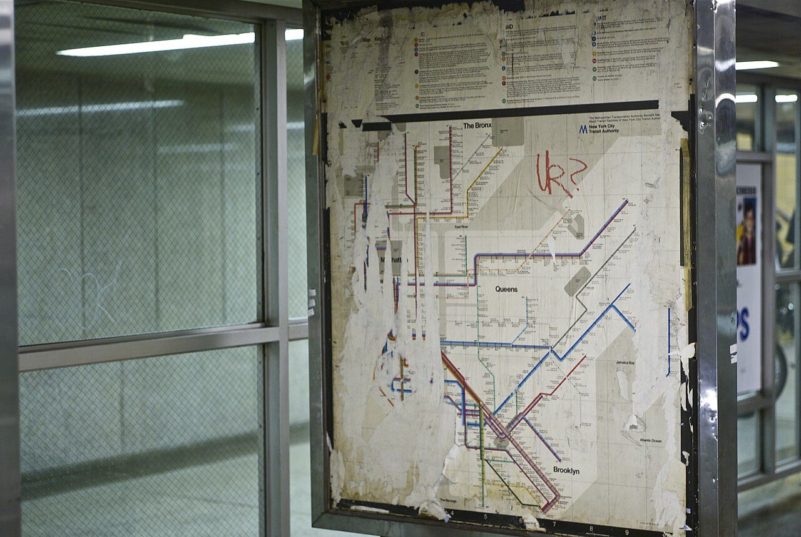 - Photograph CC BY 2.0 (Michael Cory, Wikimedia Commons); map design by Massimo and Lella Vignelli / Unimark for the MTA.

Clarity by abstraction: every route line constrained to 0, 45 and 90 degrees, one line weight, one uniform station marker, route identity encoded by colour from a small fixed palette, geography thrown away. The worn in-situ photograph, torn and tagged, adds the second lesson: an artifact built on structure alone stays legible and dignified after decades.

**Rationale.** Clarity by abstraction: lines constrained to 0, 45 and 90 degrees, one weight, uniform markers, colour-coded routes, geography thrown away on the correct intuition that riders navigate dot to dot inside the system. This optimises for tracing a path through the network at a glance. The cost is correspondence to the real city: Central Park is squared, water is beige, stations are spaced evenly regardless of true distance, so the map is useless above ground and tourists misjudged walking distances badly. Public backlash over the lost geography retired it in 1979 after seven years, the price of buying network legibility with fidelity to the world.

**Directive.** For any node-link or route view (`Graph`, a process or pipeline diagram, connector routing, `Flows`), constrain edges to a fixed angle set (orthogonal, or orthogonal plus 45), use one uniform line weight and one uniform node marker, and encode series identity by colour from a small fixed palette rather than by varying shape or thickness. Prefer a clean schematic over geographic accuracy whenever the task is to trace a path, and ship a compact fixed legend keyed to those colours. Treat the worn map as a durability test: our chrome must read correctly stripped of gloss (no gradients, no glow, flat planes, sharp corners).

### Massimo Vignelli, National Park Service Unigrid system (1977 to present)

 - Public domain (US federal government work, National Park Service), Wikimedia Commons.

One rigid invariant (a solid black title band, fixed Helvetica, modular folding panels) absorbs hundreds of parks by many authors and still reads as one identity. The constraint is the brand. Consistency at scale comes from removing per-instance styling decisions rather than policing them.

**Rationale.** One rigid invariant (a black title band, fixed Helvetica, ten standard panel sizes on a shared grid) removes per-instance styling decisions so hundreds of parks by many authors read as a single identity; the constraint is the brand. It optimises for coherence at scale and for production economy, since the panels fit standard press sheets and cut waste across roughly 20 million copies a year. The trade-off is that individual parks surrender any distinct visual identity: every brochure follows the same formula, so local character has to live in the photographs and words rather than the layout. That bargain has proven durable enough to run for decades.

**Directive.** This is the model for the toolkit itself: fix one invariant chrome and let content vary underneath it. Our equivalent of the black band is the token set (the `--sf-color-*` palette, `--sf-unit`, the three type sizes, sharp 2px corners) plus the fixed component chrome (`Pane.Header`, `Dialog.Handle` and title, `MenuBar`), and consumers must not re-skin it per screen. Every `Pane` header, `Dialog` title and `DataTable` header should look identical across an app, so "which module am I in" is answered by content rather than by re-themed chrome. When a component needs a new look, add a prop within the system (`variant`, `size`, `tone`), never a bespoke fork.

### Karl Gerstner, Designing Programmes and the Capital magazine grid (1962 to 1964)

No freely licensed image available (Gerstner's work is still largely under copyright and absent from Wikimedia Commons). Reference: *Designing Programmes*, Lars Muller Publishers; open scan at openlab.citytech.cuny.edu.

Gerstner built one fine substructure of 58 units that resolves simultaneously into 1, 2, 3, 4, 5 or 6 columns, so one grid yields many layouts without ever breaking alignment. His thesis: design the rule set (the programme) and let it generate the solutions. Flexibility and consistency are not opposites; a well-chosen programme delivers both.

**Rationale.** Gerstner's principle is to design the rule set rather than each page: one 58-unit substructure with 2-unit gutters resolves cleanly into 1 to 6 columns, delivering "a maximum number of constants with the greatest possible variability" so flexibility and consistency stop being opposites. It optimises for fast, varied, aligned layouts generated from a single programme, reducing routine choice to selection within the system. The cost is front-loaded: the intellectual work of defining the programme correctly is heavy and unforgiving, since a poorly chosen substructure constrains everything built on it, and creativity is deliberately reframed as choosing among the system's options rather than free intuition.

**Directive.** Make our layout primitives programmes rather than fixed templates. Base column systems on one fine underlying unit (`--sf-unit`) that subdivides cleanly into 2, 3, 4 and 6 tracks, so the same grid answers many densities without new breakpoints (this is how `Grid` and `FieldLayout` factor, and it matches the container-driven, breakpoint-free collapse the library favours). Prefer a rule the consumer parameterizes through props and tokens over a hardcoded arrangement. When building any new component, first define its programme (its tokens, its unit math, its allowed states) and let the specific rendering fall out.

---

## 7. Digital heirs: monospace as a signal, keyboard-first for the daily expert

Screen-native descendants that carry the instrument posture into pixels: the VT100's character grid, Bloomberg's amber-on-black expert tool, iA Writer's honest monospace, and Teenage Engineering's constrained control surfaces.

### Teenage Engineering OP-1 (2011 to present, Sweden)

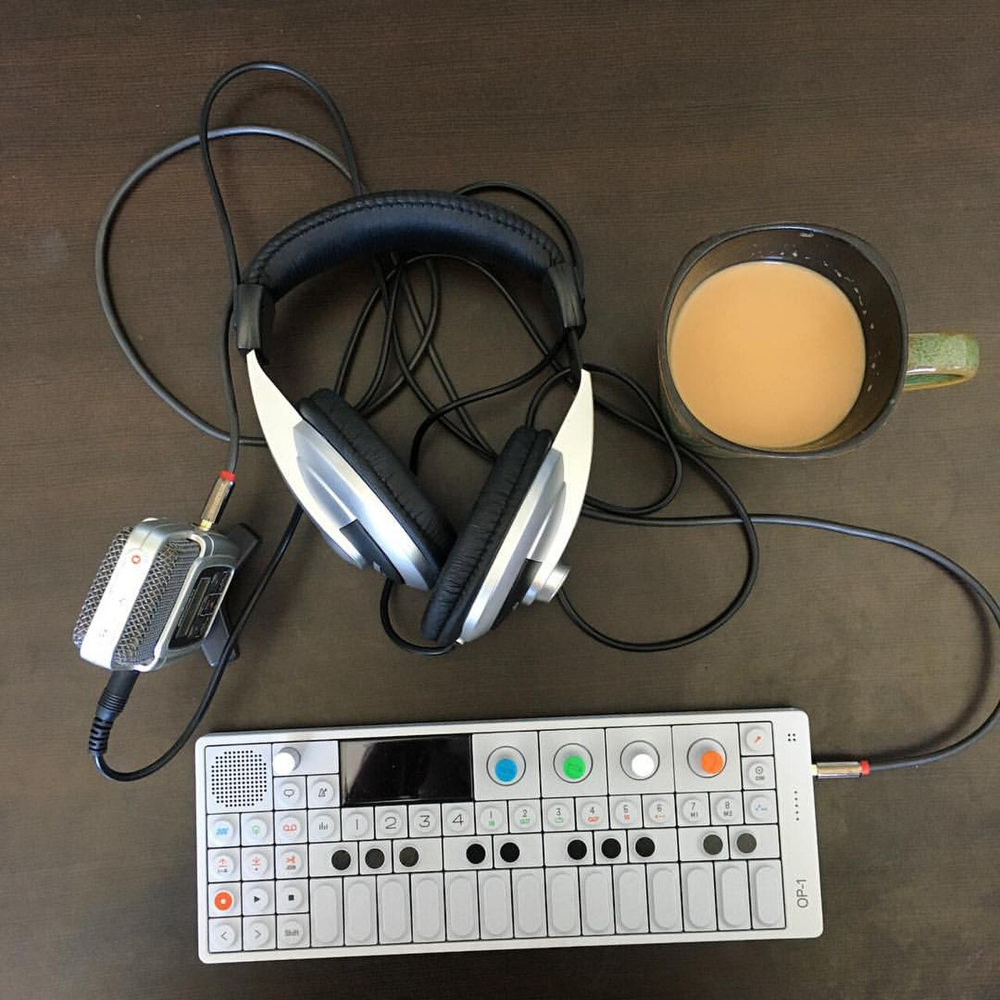 - CC BY-SA 2.0, author justin lincoln, Wikimedia Commons.

Four rotary encoders colour-coded blue, green, white, orange, where each colour maps to one live synth parameter and to the matching sector of the display. The colour is a persistent, learnable functional code, and it survives the "one accent" rule precisely because it is a fixed channel-to-colour mapping. Direct manipulation plus a tiny always-on readout is clearer than nested menus.

**Rationale.** The principle is to hold the control surface to four encoders and one small screen so every live parameter stays visible and directly turnable, and to treat the limits as the point: Teenage Engineering's own line is that limitation is the OP-1's main feature. A fixed, small parameter count per mode is what lets all of them show at once under a stable colour code; the all-visible layout would break the moment there were more than a handful to show. The cost is depth and capacity. The instrument is mono-timbral, has no undo, caps recording at a few minutes, and still commands a high price, so it buys focus and immediacy by giving up completeness and any path to scale the same layout to a richer instrument.

**Directive.** Reserve any multi-hue scheme for a fixed channel-to-colour mapping the user learns once and sees identically everywhere (a `ToggleGroup` or `DigitInput` whose N channels each own a stable token colour, echoed in the chart series that reads them); outside such a coded channel, stay neutral with the single primary accent. Give real controls generous hit targets and pair each with a small monospace readout rather than a modal. When a control set maps one-to-one onto distinct parameters, expose all of them at once and let the fixed colour code carry the wayfinding.

### Teenage Engineering Pocket Operators (2015 to present, Sweden)

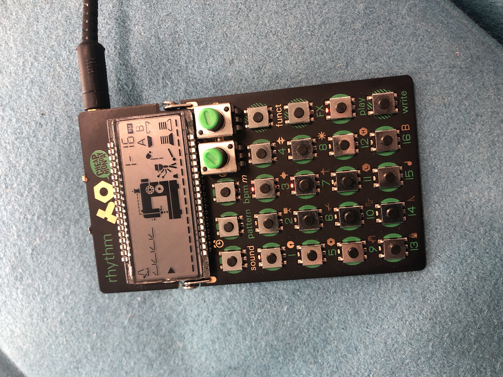 - CC BY 2.0, author Tim Walker, Wikimedia Commons.

A caseless printed circuit board that is itself the faceplate, function names silkscreened straight onto the board right where the finger lands. The construction is the product: sensitive parts hide behind the LCD so no case is needed, and the saving goes into better components. Honest construction reads as quality.

**Rationale.** The design makes the bare circuit board the faceplate and spends the saved enclosure cost on better components: Teenage Engineering states that putting the sensitive parts under the LCD removes the need for a case, and the cavity behind the display doubles as the speaker box. The principle is that honest construction and a low price justify exposing the working parts. The cost is protection and perceived seriousness, since the open board is fragile and reads as toy-like, which is why owners buy aftermarket silicone cases. Silkscreening the labels directly onto the board also fixes the layout at manufacture, so the naming can never be revised.

**Directive.** Label controls directly and locally in monospace (the control carries its own name, shortcut and unit) instead of relying on a distant legend or tooltip; lay dense, equal, tactile cells on a strict grid rather than padded cards. Take the one sanctioned skeuomorphism (`Kbd` keycaps, the tactile top-edge inset on inputs and switches) only where it makes a control read as more honest and direct, and drop it the moment it reads as merely cute. Do not hide structure behind a soft surface; let the working parts of a component be visible.

### iA Writer (2010 to present, Information Architects, Tokyo)

No freely licensed image (the app UI is copyrighted). Directive derived from iA's published design rationale.

The argument is precise: a proportional font reads as "almost published" while a monospace font reads as "work in progress," so mono is the more honest choice for draft text. iA later refined this into a duospace design so the mono grid stays honest without fighting readability. The app ships almost no settings on purpose, a single blue accent for the caret, and a focus mode that dims surrounding context rather than hiding it.

**Rationale.** A monospace draft font signals "work in progress," so iA treats it as the honest choice for text that is not ready, and it ships pre-optimised defaults so the writer writes rather than adjusts margins. The accepted cost is readability: fixed-width type flows less naturally because wide letters are cramped into the same cell, which is why iA widened M, W, m and w to 150% into a "duospace" compromise, giving up some monospace purity to recover flow. Withholding settings likewise trades customisation for focus. The app optimises for getting out of the way, at the price of configurability and of pure reading comfort.

**Directive.** Keep the monospace/sans split doing real work: `--sf-font-mono` for anything the eye scans as data or input (fields, code, tabular numerals, axis labels) and sans only for running prose, always paired with `font-size-adjust: var(--sf-font-mono-adjust)` so mono sits on the sans x-height (the same balancing instinct as iA's duospace). Use exactly one accent (`--sf-color-primary`) for the single live element (caret, active row, focus ring) and keep everything else neutral. Prefer opinionated defaults and few props over a settings panel. When you build a focus affordance, dim surrounding context transiently as a state, and never let that become resting body copy: at rest, body text is still full-strength `--sf-color-fg`, never grey.

### Bloomberg Terminal, keyboard and amber-on-black (1982 to present)

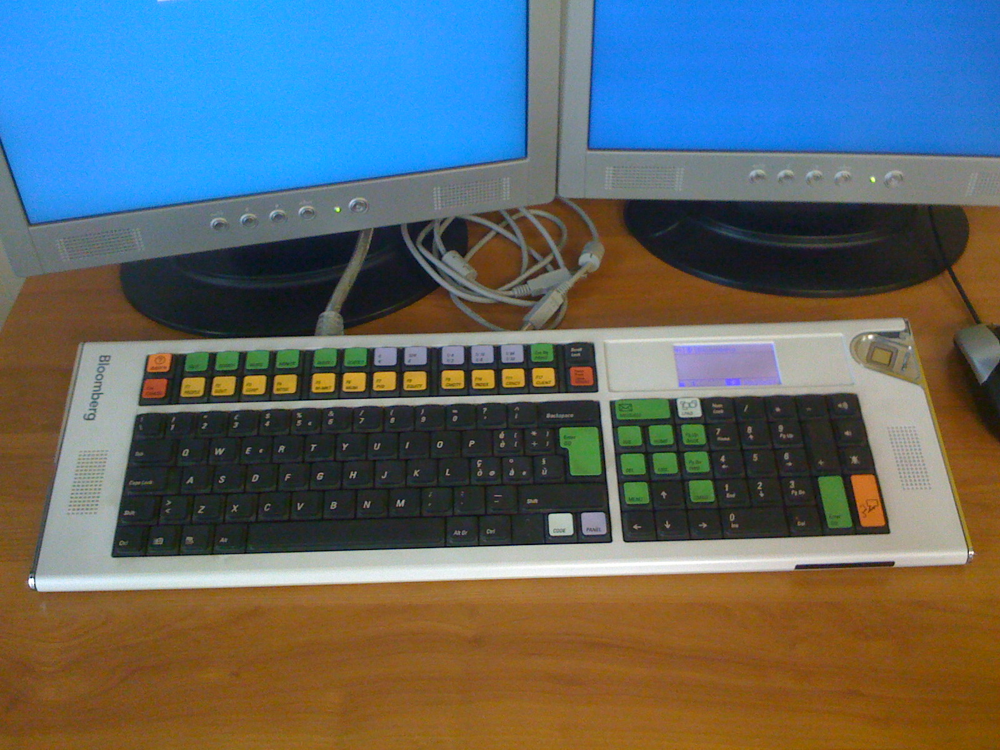 - Public domain, author Cariafraweb, Wikimedia Commons.

An expert tool that optimizes for the daily user rather than the newcomer: keyboard-first command entry with a persistent command line and a single decisive commit key, a yellow function-key bank that colour-codes the whole market namespace, and amber-on-black readouts for long sessions. The 9 by 19 monospace font was reproduced pixel-for-pixel across decades of hardware; stability and recognizability outrank fashion.

**Rationale.** The Terminal optimises for the daily professional's throughput rather than the newcomer's ease: a persistent command line, a single commit key, colour-named function keys, and a monospace font held pixel-stable across decades of hardware so muscle memory survives. The principle is fewer intermediate steps and more information per screen for someone who returns every day. The cost is a steep learning curve and low discoverability, since the user must memorise cryptic command mnemonics and a non-standard, proprietary interface that locks in the workflow. Holding stability over fashion keeps the look dated, which is the price of never breaking a returning expert's habits.

**Directive.** Treat the keyboard as the primary input surface for expert flows: a persistent command or search entry, a single obvious commit key (Enter), and discoverable shortcuts shown as `Kbd` keycaps driven by a central hotkey engine (`focusFieldHotkey`), rather than burying actions in menus. Where a set of destinations forms a stable domain namespace, give it one consistent learnable colour and label code across the whole app rather than per-screen ad hoc colour. Lean on native dark mode and full-strength contrast for long-session density (dense `DataTable`s, mono tabular numerals). Hold token names and component contracts stable across versions so a returning user's muscle memory still works.

### DEC VT100 and terminal culture (1978, and the grid it standardized)

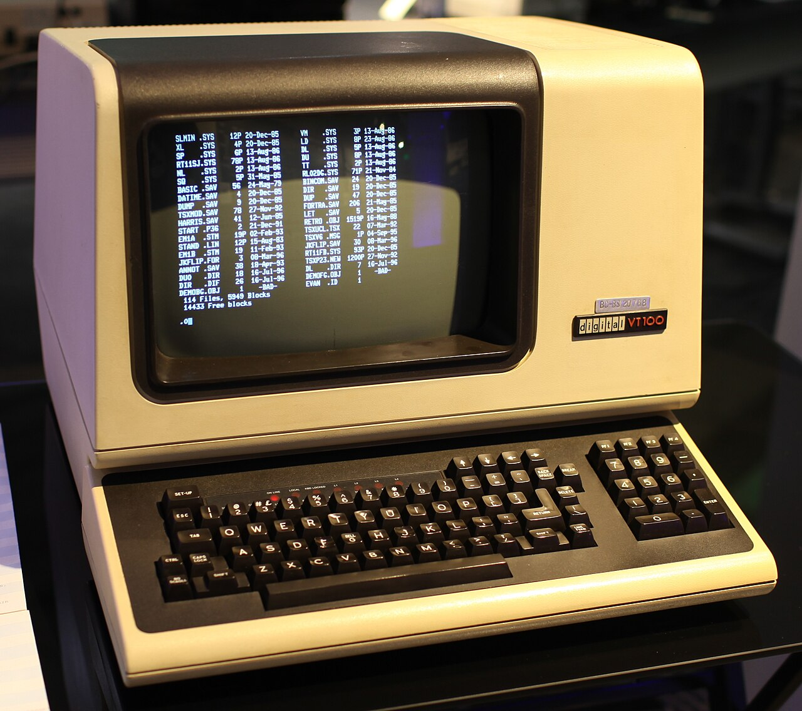 - CC BY 2.0, author Jason Scott, Wikimedia Commons.

The terminal that fixed the grammar of the text interface: a directory listing in perfectly aligned monospace columns, a footer totalling files and blocks, a solid block cursor at the prompt. Fixed-width cells are what make columns line up and near-identical glyphs (0/O, 1/l/I) distinguishable. The addressable character grid is the entire layout system, and small honest details (the block caret, hairlines on the pixel grid) make a readout feel like an instrument.

**Rationale.** The VT100 makes an addressable fixed-width character grid the entire layout system and standardises the ANSI escape-code grammar, so software runs unchanged across terminals; that portability is why it became the de facto reference and made DEC the leading vendor. The fixed cell is what lets columns align and near-identical glyphs stay distinguishable. The cost is that everything must fit the grid: no proportional type, no true graphics, no positioning between cells. Alignment and cross-hardware portability are bought by giving up typographic and graphical freedom.

**Directive.** Let a grid be the layout (CSS `Grid` on the `--sf-unit` baseline rather than ad hoc flexbox). Use tabular monospace numerals wherever values change or must line up (`DataTable` cells, axis labels, `DigitInput`, `StreamingTerminalText`) so columns scan vertically. Keep the block caret and terminal styling in `CodeEditor` and terminal surfaces. Snap all chrome hairlines (gridlines, ticks, cell edges) to the device-pixel grid while leaving data marks anti-aliased, so the scaffolding stays crisp and the readout reads as a measuring device rather than an illustration.

---

## 8. Test and measurement: one primary readout, labelled control zones, colour held for the fault

Bench and handheld electronic test instruments carry a dense function set on a rugged, legible panel: one dominant display, controls grouped into labelled zones, and saturated colour held back for a fault or an out-of-range value.

### Fluke 87 handheld digital multimeter (1988 to present)

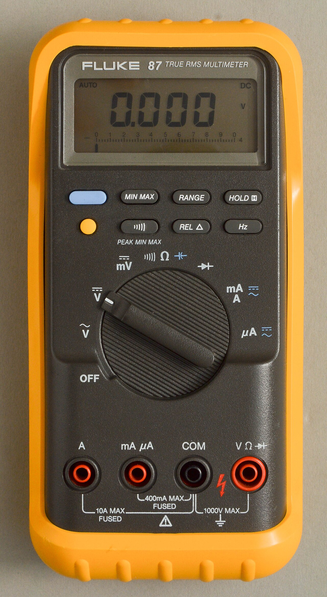 - CC BY-SA 4.0, photo Alex P. Kok, Wikimedia Commons.

A rugged handheld true-RMS multimeter, sealed in an over-molded case for field and bench use. One rotary switch at the centre selects the whole function set (DC and AC volts, resistance, milliamps and amps, frequency, capacitance, continuity, diode), so the user changes what is measured in a single place. A large LCD carries the primary digital reading, with a fast analog bargraph beneath it for trend and nulling. Range, hold, and min/max buttons sit above the dial; the guarded input jacks are grouped in one row at the bottom. Yellow appears once, on the case and the shift key. A wide function set collapses onto one selector, one dominant number carries the value while a quiet bargraph carries the trend, and the one saturated colour is spent on the shift key alone.

**Rationale.** The design optimises for one-handed field use and survival: a single rotary switch makes every function change one blind gesture at one locus, while the sealed over-mold and high-interrupt input protection (a self-resetting PTC thermistor backed by a high-rupture fuse) let the meter take drops off a ladder and a fault-current arc without failing. The cost is random access, since reaching a distant function means rotating through the whole dial, and the sealing plus protection add weight, bulk, and price over a bare DMM. The rotary contact assembly is itself the part that wears and is the common repair, the price of routing the entire function set through one moving selector.

**Directive.** Collapse a wide set of modes onto one selector (a `ToggleGroup` or `Picker`) so function changes in a single place rather than across a toolbar. Give the primary value a fixed-width readout in `--sf-font-mono` tabular figures (`DigitInput`) so digits never reflow, and place any trend or null read beneath it as a quiet secondary bargraph or sparkline that never competes with the number. Group inputs in one labelled strip. Spend `--sf-color-primary` once on the active mode, and reserve `--sf-color-danger` for a real over-range or fault, the meter's single warning state.

### Hewlett-Packard 34401A bench multimeter (1991 to present)

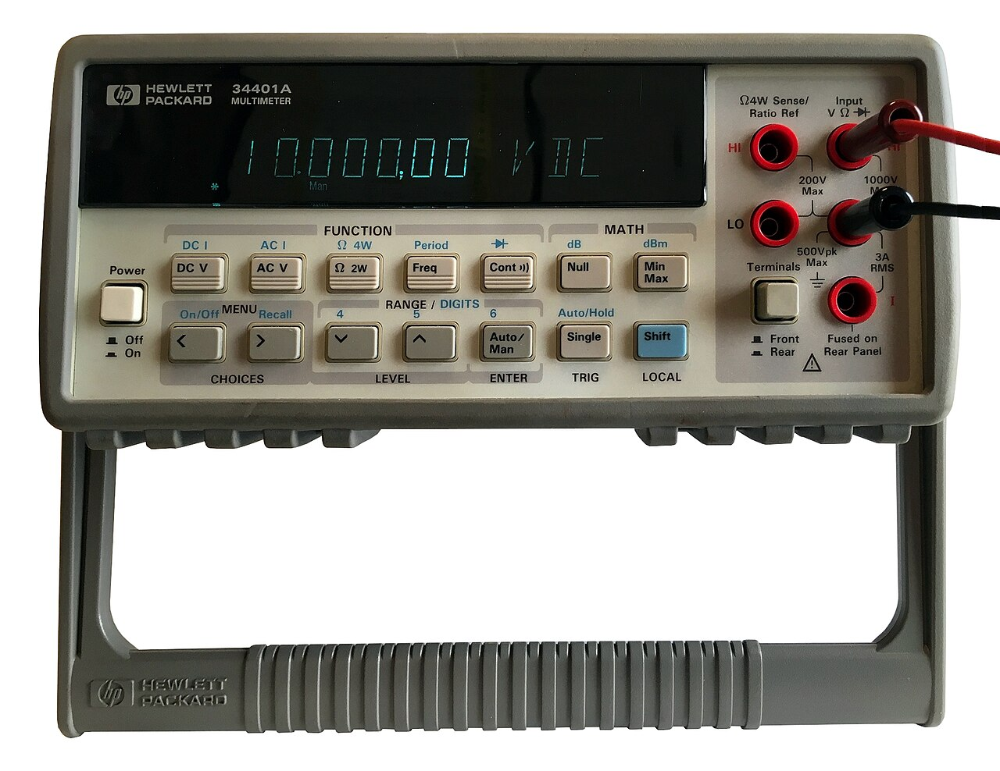 - CC BY-SA 4.0, photo Afandrf, Wikimedia Commons.

A rack-width 6.5-digit bench multimeter, in continuous production for decades under HP, then Agilent, then Keysight. One large vacuum-fluorescent display dominates the left of the panel and shows a single primary reading with a smaller secondary line folded into it. To the right, the keys are grouped into labelled task zones: a row of function keys (DC and AC volts, resistance, current, frequency, continuity, diode), a math and null block, and range and resolution keys. Each key prints its shift function above it in the same monospace legend; the layout and the printed labels, rather than colour, carry the structure. Hierarchy comes from grouping and printed labels, the secondary value folds into the primary display, and no key legend is dimmed to make room for it.

**Rationale.** It is built to be the general-purpose bench workhorse that is good at everything rather than best at one thing, hitting a price, accuracy, and usability point that made it the most-produced 6.5-digit DMM. Panel structure comes from grouping keys into task zones and printing each shift function above its key in the same monochrome legend, so one large vacuum-fluorescent display and the labels carry the hierarchy without colour. The cost is that every key does double duty through a printed legend the user must learn, and the generalist brief gives up both the resolution of a metrology-grade reference DMM and the throughput of a dedicated system meter.

**Directive.** Split a measurement surface into one dominant output region and a control region grouped into labelled task zones on the `--sf-unit` grid, cued by spacing and a single `--sf-color-border` rule rather than by boxing each group (`Pane.Header` over `Pane.Body`). Give the primary value one large readout in `--sf-font-mono` tabular figures and fold any secondary value into that same region rather than adding a panel. Keep every key legend full-strength (`--sf-color-fg`) at a single weight, and spend `--sf-color-primary` only on the active function or a shift class the user learns once.

### Hewlett-Packard Nixie frequency counter (early 1960s onward)

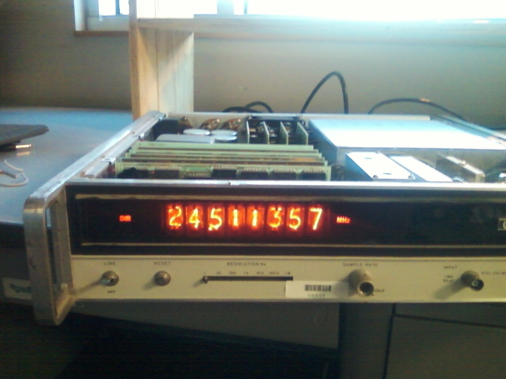 - CC BY 2.0, photo Sterling Coffey, Wikimedia Commons.

A bench electronic counter that reads frequency, period, ratio, and totalize on a horizontal row of Nixie tubes. HP's Nixie-tube counters date from the early 1960s onward. The bright numerals form one register that reads at a glance, with a units annunciator beside it. Below the display sits a bank of switches and knobs for function, gate time or sample rate, trigger level, and input coupling. The display is the one bright element; the controls are a matte functional field. A single bright register reads at a glance above a labelled bank of mode and gate controls, and the numerals scan as one line.

**Rationale.** Because the count is the instrument's whole output, the design spends legibility on it alone: a single in-line register of large, bright Nixie numerals that scans as one line and reads at a glance, replacing the earlier hard-to-read vertical neon column, with every control demoted to a matte field below. The bright glow is bought at real cost: Nixie tubes run on roughly 170 V, draw power, generate heat, and wear out as their cathodes age, and their stacked digits sit at slightly different depths. The counter accepts high voltage, heat, and a limited service life to get numerals a technician can read across the bench without hunting.

**Directive.** Render a live count as one horizontal register of `--sf-font-mono` tabular figures on a recessed surface (`--sf-color-input-bg`), so the whole number scans as a single line and digits seat in fixed cells (`DigitInput`). Set the unit beside it as a small `--sf-font-size-sm` label (legitimate secondary metadata, so `--sf-color-fg-subtle` is warranted here), the counter's annunciator. Gather function and gate controls into a `ToggleGroup` beneath the readout rather than scattering them. Keep the numerals full-strength on a quiet field and reserve `--sf-color-danger` for an overflow or over-range, the counter's one alarm.

### Linear bench DC power supply (1960s archetype, this unit c. 2015)

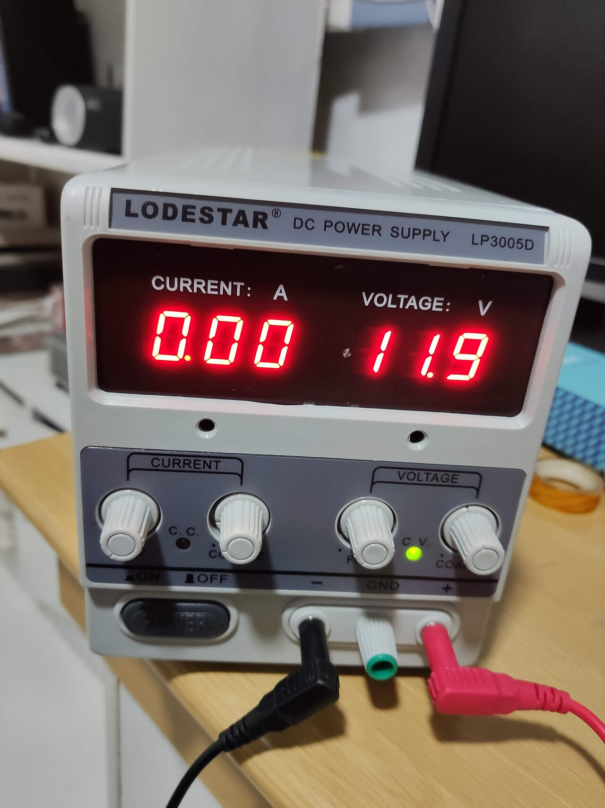 - CC0 1.0 public domain dedication, photo Derrick Parker, Wikimedia Commons.

A single-output linear bench supply of the common 0 to 30 V, 0 to 5 A form (photographed here as a LodeStar LP3005D, one of many badge-identical units). Two digital readouts sit side by side, one for volts and one for amps, each a fixed-width numeric display. A coarse and a fine knob under each set the target. Two indicator lamps mark the operating mode: CV lights in normal voltage regulation, and CC lights when the load reaches the set current limit and the supply leaves voltage regulation. Output terminals are grouped and colour-coded at the bottom. The panel archetype descends from HP's 1960s linear supplies. Two coupled readouts read side by side, a coarse control pairs with a fine one on the same value, and colour marks the current-limiting state rather than decorating the panel.

**Rationale.** The panel treats the supply's entire state as two coupled numbers, volts and amps read side by side, each with a coarse and a fine control on the same value, and it lights CV or CC only to name which regulation mode is active rather than to decorate. Linear regulation is the deliberate choice for clean, low-noise output that sensitive circuits need. The cost is efficiency: the pass transistor burns the difference between input and output voltage as heat, so the supply runs hot and needs a large heatsink and transformer, leaving it heavy and bulky next to a switching supply of the same rating.

**Directive.** Show coupled outputs as two co-aligned `DigitInput` readouts in `--sf-font-mono` tabular figures, so the whole output state reads in one glance (`FieldLayout` rigid rows hold them on the grid). Pair a coarse control with an inline fine nudge on the same value rather than two distant controls. Mark the operating mode with a `Chip` carrying a `dot`: neutral for constant-voltage regulation, and `--sf-color-warning` for constant-current limiting, the one state that means the supply left regulation. Keep terminals grouped in one labelled strip and everything else neutral.

---

## 9. Industrial control and HMI: fixed layouts, staged input, status lit by a real condition

Control-room and machine-tool panels hold a fixed layout, stage input before it takes effect, and light a status indicator only when its condition is true.

### Apollo Guidance Computer DSKY (1966 to 1975, flew 1968 to 1972)

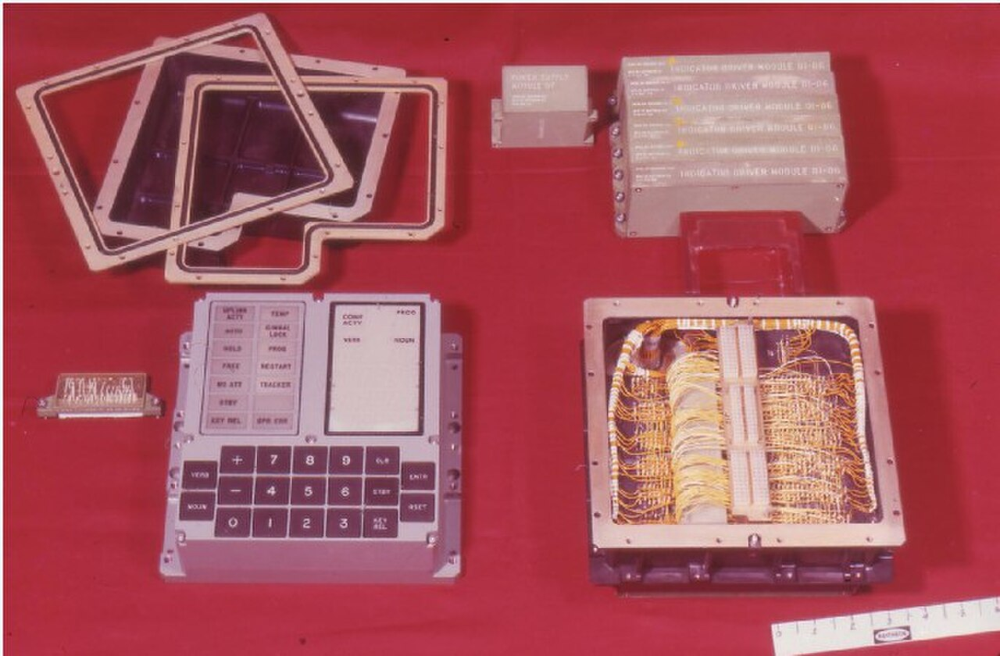 - Public domain (work of NASA), Wikimedia Commons.

The Display and Keyboard unit of the Apollo Guidance Computer, the crew's interface to the flight computer in the Command and Lunar Modules. A numeric keypad with VERB, NOUN, ENTR and reset keys; a two-digit VERB field, a two-digit NOUN field and three five-digit signed registers in electroluminescent green; and a block of labelled status lamps (COMP ACTY, OPR ERR, PROG, GIMBAL LOCK, and the rest). A two-part command grammar, VERB names the action and NOUN the operand, is keyed digit by digit, held on the display, and committed with one ENTR; the signed five-digit registers never change width and each lamp lights only on a real condition.

**Rationale.** The verb/noun grammar let a computer with very limited memory and a seven-segment display address close to two hundred operations from one small numeric keypad, and the closed two-part form committed on a single ENTR meant a command was either fully keyed or not issued at all. It optimises for a machine and a pair of hands that cannot afford an accidental half-command in flight. The cost is that the vocabulary does not fit on the panel: the crew carried it in memory and on paper cue cards listing the verb and noun pairs, so the interface is opaque without training. The computer's economy is paid for in the operator's recall.

**Directive.** Model structured command entry as an explicit two-part grammar with a single commit. Where an action needs an operand (a command bar, a bulk edit over selected `DataTable` rows), stage the action and its target as two adjacent labelled `Field`s and commit both on one deliberate Enter, echoing the keyed value back before it takes effect. Hold entered numbers in fixed-width `DigitInput` cells with tabular mono figures so a signed five-digit register keeps its width as it fills. Show the interaction stage on the field itself: while it waits for the operator to complete or confirm, mark it with the quiet `--sf-color-primary` focus state rather than recolouring the value. Reserve status indicators for real conditions: an operator-error flag lights `--sf-color-warning` on a rejected keystroke and clears on the next valid one, and a resting readout carries no colour.

### NASA Mission Control console, MOCR (mid-1960s to 1990s)

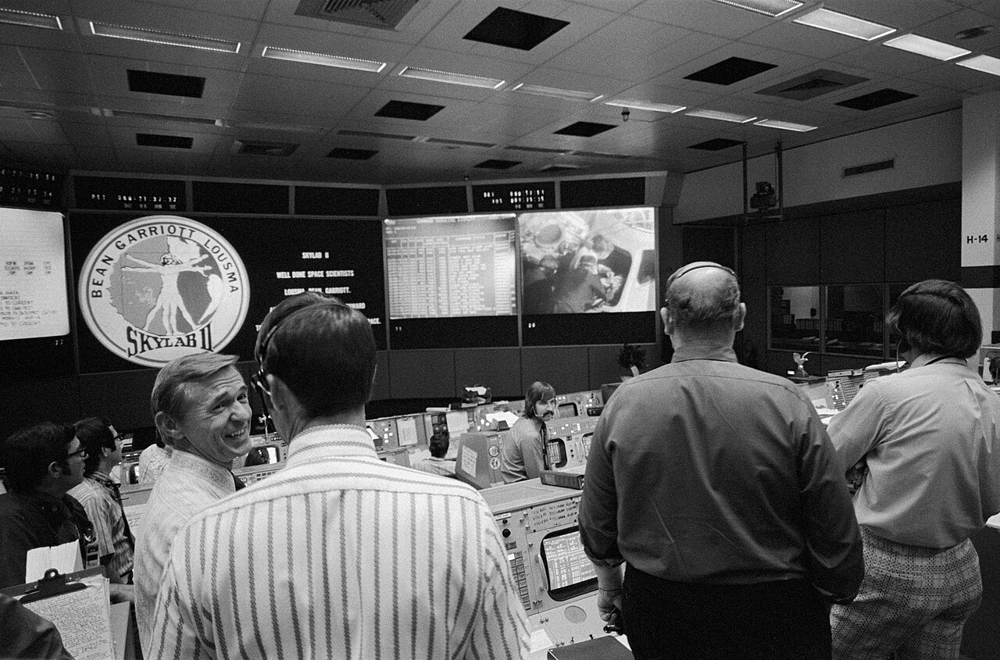 - Public domain (work of NASA), Wikimedia Commons.

The Mission Operations Control Room in Building 30, Houston: rows of identical consoles, each assigned to one flight controller, each a bank of illuminated event pushbuttons, a few monochrome CRTs showing telemetry in fixed columns, and an intercom keyset, with a shared front wall of trajectory plots and mission clocks. The room ran continuous shifts for days at a stretch. Every operator works an identical console in a fixed position, detail stays local while one shared board carries the room's state, and the layout transfers directly between shifts.

**Rationale.** Building every console to one identical format in a fixed position optimises for interchangeability: a controller's training, the written procedures and the physical layout all transfer between people and across the round-the-clock shifts a mission ran. Common state was raised onto one shared front wall so the whole room read the same trajectory and clocks without each station duplicating them. The trade-off is that no position gets hardware tuned to its own task, every seat works the same generic console, and the shared picture sits away from an operator's local detail, needing a glance up to the wall. Reliable handover over days of continuous operation is bought with that uniformity.

**Directive.** Give a multi-operator or multi-panel app a fixed console layout: each region a permanent `Pane` or `Grid` slot in an identical format, so a user returning after an interruption finds every control where they left it and the arrangement transfers between people. Keep each operator's detail local (their own `DataTable` of telemetry in fixed mono columns) while one shared status strip in a single `Pane.Header` carries the state everyone must see, never duplicated per panel. Build for the long shift: full-strength `--sf-color-fg` on near-black, dense fixed columns, nothing competing with the numbers. Event indicators light only on their event, so a resting console shows no colour and no badge.

### CNC machine-tool control, Siemens Sinumerik (c. 1979 to 1984)

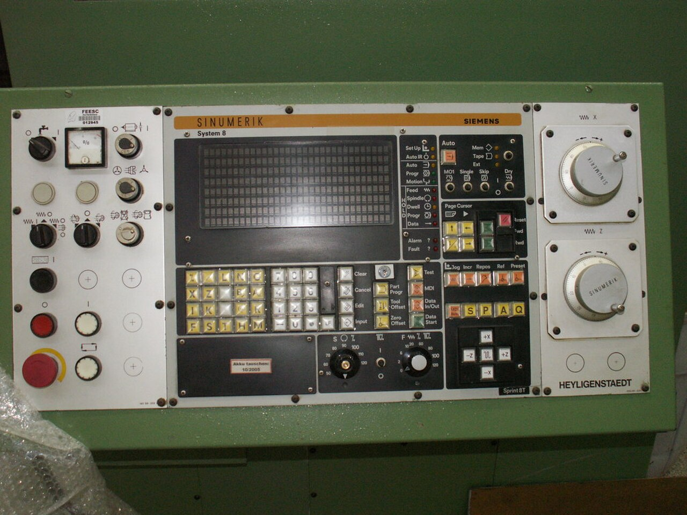 - CC BY-SA 2.0, photo Carlos Vieira (via Flickr), Wikimedia Commons.

The operator panel of a CNC machine tool, here a Siemens Sinumerik turning and milling control. A monochrome position readout showing axis coordinates in fixed-decimal fields, an alphanumeric keypad for entering and editing G-code blocks, soft keys whose function is labelled on the screen above them, a mode selector (jog, MDI, auto, edit), feed-rate and spindle overrides, single-block and dry-run steppers, and a hard emergency stop. Fanuc and Bridgeport panels share the same grammar. Machine mode is selected explicitly and shown at all times, one set of soft keys serves many functions because each is labelled where the finger lands, and the emergency stop is the one control set physically apart.

**Rationale.** Soft keys let a few physical buttons cover a large, context-dependent function set by printing each function on the screen exactly where the finger lands, and an always-shown mode selector plus a preview path (single-block, dry-run) keep the operator from acting blind on a machine that can wreck a tool or a part. This optimises for breadth of control from a compact panel and for catching a mistake before it reaches the work. The cost is a layer of indirection: the operator must read the current label before each press, and mode confusion becomes a real hazard, which is why the mode is displayed at all times and the emergency stop alone stays hardwired and set physically apart.

**Directive.** Make machine mode explicit and always visible with a `ToggleGroup` that names the current mode (edit, run, step) so the user never guesses which one is active. Label context-dependent controls in place, on or beside the control the way a CNC soft key carries its current function on the screen, rather than in a distant legend. Render every coordinate or measured value as a fixed-decimal `DigitInput` or `DigitInputMicro` in tabular mono so the readout holds its width while the number moves. Offer a preview-before-commit path for anything that acts on the world, a dry-run or single-block step that shows each change before it applies. Set the one destructive action apart and give it alone `--sf-color-danger`: a `Button variant="danger"` sized larger and separated by space, the panel's emergency stop.

### Marine engine-order telegraph, Chadburn (1870s to 1950)

 - CC BY-SA 4.0, photo TedColes, Wikimedia Commons.

The bridge instrument for ordering engine power. A circular dial engraved with a fixed ring of discrete orders (Full, Half, Slow, Dead Slow Ahead, Stop, and the mirrored Astern set), a handle the officer swings into a detent at the ordered sector, and a bell. Moving the handle rings a matching telegraph in the engine room; the engineer answers by swinging to the same order, which drives a reply pointer on the bridge dial. The order counts as received only when the two pointers agree. A command is a choice from a small fixed set of detented positions, staged rather than assumed done, and the ordered and acknowledged states sit on one face so a mismatch is visible.

**Rationale.** The two-pointer handshake makes an order count only once the engineer swings his handle to match and the reply pointer agrees, so the bridge sees confirmation rather than assuming a sent command was carried out. Restricting orders to a ring of detented positions means the officer selects one engraved state and never a meaningless value between two. Both choices optimise for a command that is unambiguous and known to be shared by both ends. The price is speed and precision: the acknowledgment adds a round trip, and the coarse detents cannot state an exact speed, so a precise RPM figure had to be passed through a separate channel.

**Directive.** For a command with a small fixed set of valid states (a run level, a power mode, a pump on or off), use a discrete detented control, `ToggleGroup` or `Picker`, so the user selects one engraved position and never a meaningless value between two. When the command crosses to a system that must carry it out, do not render it as done on send: show the requested state and the confirmed state together (two `Chip`s, or a requested and acknowledged pair in a status strip) and treat the command as settled only when they agree, flagging a lingering mismatch with `--sf-color-warning`. Give the selection a physical detent with `--sf-ease-snap` on the single committing move so the control seats like a handle into its notch. Keep the position labels engraved in mono and always visible, never hover-revealed.

---

## 10. Audio and broadcast consoles: one repeated module, honest metering, a traceable signal path

One channel-strip module repeated until the eye learns it, metering that reports the real level, and a signal path the eye can trace from top to bottom.

### Solid State Logic SL 4000-series console channel strip (1979 onward)

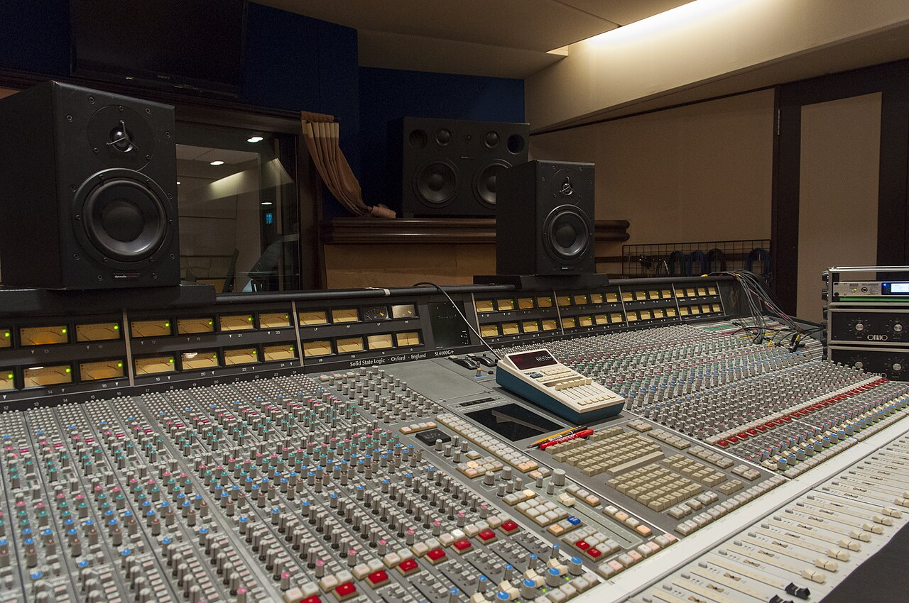 - CC BY-SA 3.0, photo JacoTen, Wikimedia Commons.

A large-format analog recording console (an SL4064G+ shown) built from one channel strip repeated across the whole desk. Every strip runs the same vertical order: input gain at the top, then the equaliser, then the dynamics section, then routing, then a long-throw fader at the bottom. The signal moves down the strip in the order the controls are stacked. Density comes from repeating one identical module, so the engineer learns the strip once and reads it across every channel.

**Rationale.** The principle is one identical in-line module repeated across the whole desk, each strip running the same fixed order (input gain, equaliser, dynamics, routing, fader) so the signal always travels downward and the engineer learns the strip once then reads it on every channel. It optimises for scanning and muscle memory: position rather than a label tells you which control you hold, and settings recall lets a mix be reconstructed later. The cost is that uniformity forbids tailoring. Every channel carries the full processing chain whether the source needs it or not, which makes the desk physically enormous and expensive, and the fixed vertical order cannot be rearranged for an unusual signal flow.

**Directive.** Build a dense control surface as a uniform `Grid` of modules that share one internal template, each column the same order of controls on `--sf-unit` tracks, so scanning is learned once and reused across every column. Keep the vertical order a real signal path (input at the top, transform in the middle, output and commit at the bottom), the way a `Field` stack or a `DataTable` column already reads. Hold every module identical so position rather than relabelling tells the user which one they are in, and keep readouts in `--sf-font-mono` with tabular figures so levels line up across strips.

### Studio patchbay, TT/bantam (1970s to present)

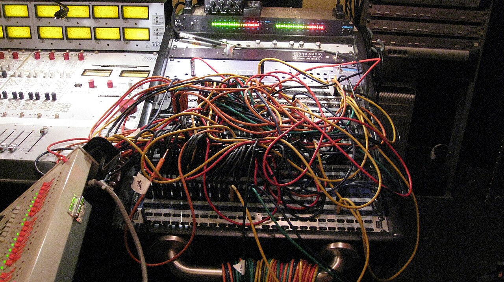 - CC BY-SA 2.0, photo VACANT FEVER, Wikimedia Commons.

Rows of identical jack sockets that route any output to any input in the studio. Convention places outputs on the top row and inputs on the bottom, each jack labelled beneath it. A patch cord makes one route physically visible; many bays are normalled, so a sensible default connection stays live until a cord overrides it. Routing is exposed and hand-editable as a grid of identical cells, the top-output and bottom-input convention is learned once, and a connection is a visible cord rather than a hidden setting.

**Rationale.** The principle exposes all routing as a physical grid of identical jacks, any output patchable to any input, with each connection made visible as a cord and a sensible default kept live by normalling so the common path needs no cord. It optimises for total, inspectable flexibility: one cell teaches the whole field and the resting route is already wired. The cost is that normalling reintroduces the hidden connection the cord was meant to expose, so an engineer can be misled by a route that carries signal with nothing plugged in. The scheme also leans on learned convention (outputs on top, inputs below, half- versus full-normalled) and disciplined labelling, without which a dense bay of matching jacks is unreadable.

**Directive.** When two parts of an interface connect, draw the connection explicitly: reach for `Graph`'s visible, editable edges or a rendered line rather than burying the relationship in a config dialog. Lay repeated connection points as a uniform `Grid` of identical cells parted by `--sf-color-gridline` hairlines, labelled locally in `--sf-font-mono`, so one cell teaches the whole field. Where a control has a sensible default route, show that resting state directly (a `Chip` with a `dot`, a pre-filled value) rather than leaving the user to guess what is wired to what.

### VU meter (standardised 1939)

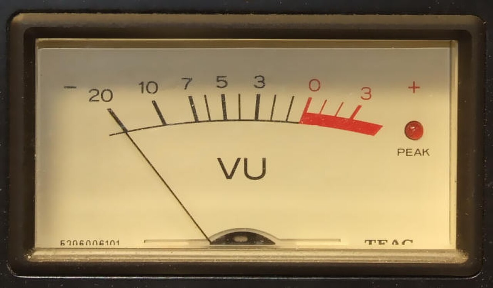 - CC BY-SA 3.0 / GFDL / CC BY 2.5, photo Iainf, Wikimedia Commons.

A moving-coil needle over an arc scale, marked in volume units with 0 VU as the reference and a red zone above it. Its ballistics average the signal over roughly 300 milliseconds, so the needle reports perceived loudness and passes over brief transients. Metering reports the level a listener perceives by integrating the signal, the scale stays neutral until a genuine overload, and the averaging is a chosen response tied to the data.

**Rationale.** The principle averages the signal over roughly 300 milliseconds so the needle reports perceived loudness the way the ear integrates it, and holds the scale neutral until a genuine overload past 0 VU. It optimises for a reading that tracks how loud something sounds and for a calm needle that does not twitch on every transient. The cost is that it is blind to peaks: a snare hit or plucked string can sit 6 to 10 dB above the reading, so the meter carries no headroom information and the operator must mentally add a safety margin to avoid clipping. It answers how loud, and cannot answer how close to overload.

**Directive.** For any level or load readout, keep the scale neutral (`--sf-color-fg`, `--sf-color-gridline` ticks) along its whole length and spend `--sf-color-danger` only on the region past a genuine threshold, the way the red zone sits above 0 VU. Pair the analog sweep with an exact figure in `--sf-font-mono` tabular numerals inside a fixed-width box so the number never reflows. Where a value is averaged or smoothed, make that a stated, measured response tied to the data rather than a decorative ease, and give it a `prefers-reduced-motion: reduce` static fallback.

### BBC Peak Programme Meter, Sifam movement (1930s onward)

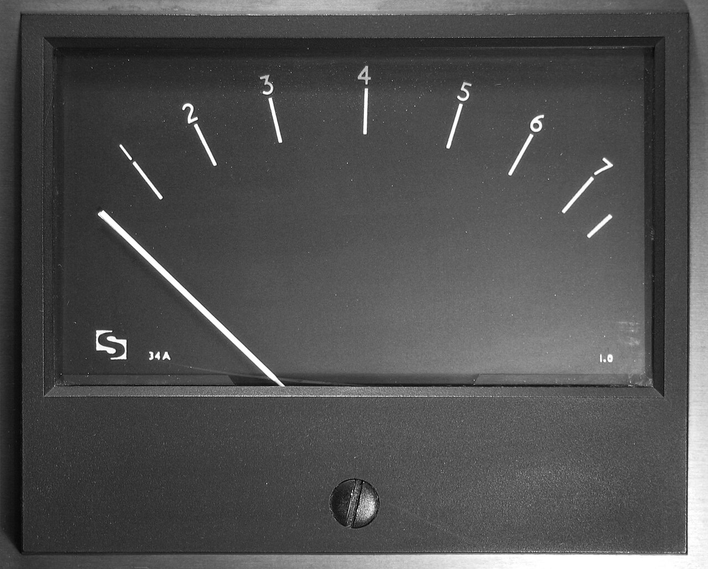 - CC BY-SA 3.0 / GFDL, photo Harumphy, Wikimedia Commons.

A black-faced meter with a white scale numbered 1 to 7, four decibels between marks, driven by quasi-peak ballistics: fast attack to catch short peaks, slow decay so the reading holds long enough to see. It measures peak level where the VU meter measures average. Peak metering catches the brief overloads that averaged metering passes over, so an engineer picks the meter that matches the decision, loudness or headroom, and two honest meters beat one number forced to mean both.

**Rationale.** The principle uses quasi-peak ballistics: a fast 10-millisecond attack catches brief peaks and a slow decay of about 24 dB over 2.8 seconds holds the reading long enough to see, on a coarse scale numbered 1 to 7 at 4 dB per division that stays legible across a long shift. It optimises for the headroom decision the VU meter cannot serve, measuring peak level where the VU averages. The cost is that it under-reads very short transients by around 4 dB (quasi-peak rather than true peak) and its coarse, peak-only scale reports nothing about perceived loudness, so it needs the averaging meter beside it to answer that question. Two honest dials cost panel space and ask the engineer to read both.

**Directive.** When one number cannot answer two questions, show both readouts and label what each measures rather than collapsing them into a single figure; choose the metric by the decision it serves (a peak against an average, a rate against a total). Render a long-session scale the way this dial does: high-contrast, evenly spaced, `--sf-color-fg` at full strength on near-black in dark mode, leaning on the `[data-theme="dark"]` lit-edge model so the scale carries the contrast. Keep the marks crisp and pixel-snapped while the moving indicator stays anti-aliased, and hold the numeric readout in tabular `--sf-font-mono`.

---

## 11. Olivetti and Italian rationalism: the keyboard as a precise instrument, restraint carrying a measured warmth

Olivetti and the Italian rationalist tradition treat the keyboard as a precise instrument, and let disciplined restraint carry a measured degree of warmth.

### Olivetti Programma 101 "La Perottina" (1965, styling Mario Bellini, engineering Pier Giorgio Perotto)

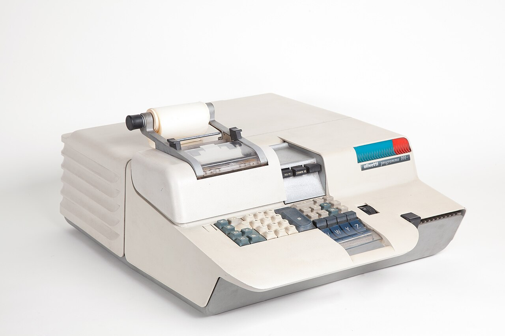 - CC BY-SA 4.0, photo Alessandro Nassiri (Museo della Scienza e della Tecnologia, Milano), Wikimedia Commons.

The first self-contained desktop programmable computer, shown at the 1964 World's Fair and in volume from 1965. A keyboard, a magnetic-card reader, and a printing unit sit in one wedge-shaped cast body sized to a single desk; NASA bought ten to plan the Apollo 11 landing. A computation printed onto a paper tape the operator kept, and the program lived on a magnetic card the operator loaded. One person ran the whole machine at their own table, with no console room and no shared mainframe. A full task collapses into one instrument the operator owns at the desk, and a run leaves a durable printed record rather than a reading that scrolls away.

**Rationale.** The principle is to collapse a whole computation into one desk-sized instrument a single operator owns outright: its own keyboard, its own magnetic-card storage, its own printed output, with no console room or shared mainframe. Perotto's team deliberately positioned it as a "calculator" to keep the project self-contained and out of General Electric's reach, and Bellini's low wedge held it to one desk instead of Marco Zanuso's mainframe-scaled box. The cost was raw capability: 240 bytes across ten registers on a magnetostrictive delay line cycling at 2.2 ms, so it traded computational power and speed for the ownership model, and at about $3,200 it charged mainframe-adjacent money for one person's table. It optimises for a single operator owning an entire task at their desk and gives up scale, memory, and shared throughput.

**Directive.** Compose a whole task into one self-contained `Pane` the user owns: the entry row and its commit `Button` at the near (bottom) edge on the `--sf-unit` grid, the working surface above, and a persistent append-only record of results below (a monospace `StreamingTerminalText` or a scrollable log) rather than scattering steps across modal dialogs. Keep that record durable and scannable in `--sf-font-mono` tabular figures rather than a toast that fades; a value the user acted on should stay on the page as a printed line. Let one operator own the full pipeline in one surface instead of routing them through a wizard.

### Olivetti Divisumma 18 (1973, Mario Bellini)

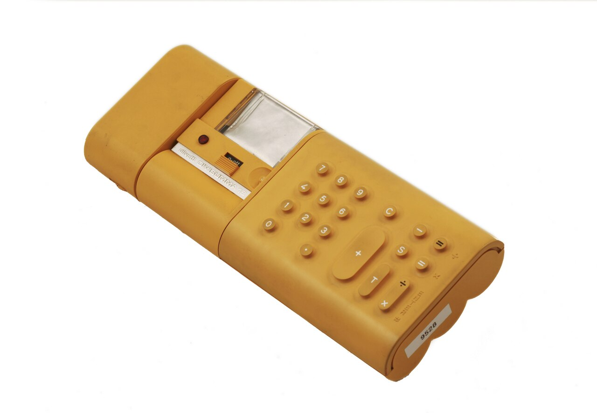 - CC BY-SA 4.0, photo Peter Aaron (Museo della Scienza e della Tecnologia, Milano), Wikimedia Commons.

An electronic printing calculator whose keypad is one continuous flexible skin: cylindrical "volcano" keys rise from and round back into a single moulded rubber membrane, sealing the mechanism from dust. The body is a warm yellow. Bellini set out to make an electronic product tactile and inviting to the hand, and MoMA holds it. The keys read as one coherent surface rather than a field of separate switches. Warmth is measured to one degree: the instrument gains tactility by making the control surface respond under the finger and by resolving many keys into one continuous plane.

**Rationale.** The principle is to humanize an electronic instrument through touch by resolving every key into one continuous moulded rubber skin, each "volcano" key backed by spring steel for a light positive action while the membrane seals the mechanism from dust. Bellini optimised for a tactile, inviting, almost playful surface and a single sculptural body with minimal seams. The cost was durability and reach: the rubber skin was expensive to produce and hard to mass-manufacture, appealed to only a narrow segment, and aged badly, as UV light hardened, cracked, and faded the membrane on surviving units. It buys a unified tactile plane at the price of manufacturability, longevity, and broad market fit.

**Directive.** Spend the one sanctioned tactile cue here rather than on anything gaudier: the `inset 0 1px 0 rgb(255 255 255 / 0.18)` top-edge highlight on entry controls plus `--sf-ease-snap` on the single committing keystroke, so `DigitInput` or a keypad seats each digit like a detent and reads as responsive under the finger. Resolve a grid of cells into one instrument, a single bordered surface with hairline `--sf-color-gridline` dividers between digit cells rather than a scatter of separately bordered boxes. Hold the warmth to that one tactile degree and keep the surface neutral; the Divisumma earns its character from feel, so route any pull toward a warm decorative fill back to `--sf-color-bg`.

### Olivetti Lettera 22 (1950, Marcello Nizzoli)

 - CC BY-SA 3.0 (dual with GFDL 1.2+), photo Austin Calhoon, Wikimedia Commons.

A low, light, quiet portable mechanical typewriter, carried by journalists and writers and operated for hours at a stretch. The Illinois Institute of Technology named it the best-designed product of the previous 100 years in 1959; it won the Compasso d'Oro in 1954 and stayed in production for 15 years. The muted crackle finish recedes and the keyboard is the whole instrument, tuned for economy of means and low-fatigue use. The tool is judged by tens of thousands of fatigue-free hours, so at rest it recedes and the user's work is the only strong thing on the surface.

**Rationale.** The principle is economy of means tuned for low-fatigue portable writing: about 3.7 kg, a compact basket-shift mechanism where the typebar unit rises rather than the whole carriage, enclosed in a sculptural aluminium shell so nothing protrudes and the keyboard becomes the whole instrument. Nizzoli optimised for hours of mobile work that recede into the background. The cost was capacity and completeness: the portable format simplified the layout (the Italian keyboard dropped 0 and 1 for O and lowercase l, and omitted uppercase accented vowels) and the lighter carriage gave up the width, the endurance under continuous heavy use, and the full feature set of an office standard machine. It trades the capacity of a desk-bound standard for portability and fatigue-free long sessions.

**Directive.** Design for the forty-hour week: keep resting chrome quiet and low-contrast (neutral `--sf-color-bg`, hairline `--sf-color-border`) so the user's content carries the only strong contrast, and reserve `--sf-color-primary` for the active control. Make the keyboard the primary surface, every action reachable without the mouse through a central hotkey engine and `focusFieldHotkey`, `Kbd` keycaps naming the shortcut in place, and full keyboard navigation across `DataTable`, `Explorer`, and `Menu`. Prefer economy of means, a light default with few controls on the `--sf-unit` grid, over a dense panel the hand has to hunt through.

### Olivetti Valentine (1969, Ettore Sottsass with Perry A. King)

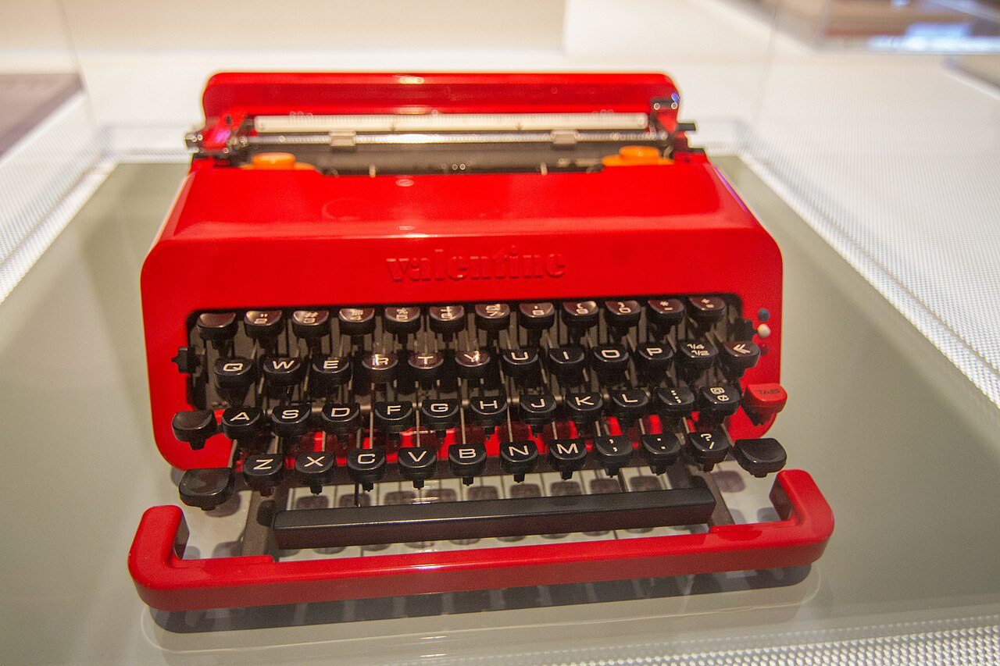 - CC BY-SA 4.0, photo Maksym Kozlenko, Wikimedia Commons.

A portable typewriter in lipstick-bright red ABS plastic, built on Lettera 32 mechanics and launched on Valentine's Day 1969. Sottsass chose the saturated red "so as not to remind anyone of monotonous working hours" and pitched it for anywhere except the office. It became an icon and entered MoMA's collection by 1971, though as a working tool it sold in the tens of thousands against a projection of millions. The colour carries mood across the whole body and codes nothing. This is the boundary of the tradition, where colour and form turned toward personality; the red is total and decorative, spent on mood rather than on marking a state, and it marks exactly the line the colour discipline holds.

**Rationale.** The principle is to give a working tool a mood and pull writing out of routine, with saturated colour carried across the whole body as feeling. Sottsass designed it as a near-disposable object, prototyped in cheap Moplen and stripped down (no lowercase, exposed ribbon caps, no margin bell) to sell as cheaply as a ballpoint pen. The trade-off landed in production: Olivetti overrode him with costly impact-resistant ABS and restored the omitted functions, which distanced Sottsass from the project and left an expensive, functionally middling machine. It optimises for expressive identity and gives up affordability, functional focus, and the volume it was meant to reach, while the total colour marks no state at all.

**Directive.** Use the Valentine as the review test for colour: if a surface is saturated all over at rest and the colour marks no state, it is decorative and should return to neutral `--sf-color-bg` / `--sf-color-fg`, with `--sf-color-primary` and the semantic tones spent only on what is interactive, focused, committed, or a genuine state. Keep the two kinds of warmth separate: a measured tactile degree in the feel (the Divisumma cue) is sanctioned, while colour spread across resting chrome as mood is not. When a request asks for a bright or fun surface, answer with typographic hierarchy and one coded accent rather than a full-body fill, and cite the Valentine when decorative colour creeps into a resting control.

---

## 12. Bang and Olufsen (Jacob Jensen): flush panels, one material, one axis, controls concealed until use

Jacob Jensen's designs for Bang & Olufsen hold one material across a flush face, align every control to one axis, and conceal the set-once controls until the moment of use.

### Bang & Olufsen Beogram 4000 (1972, Jacob Jensen)

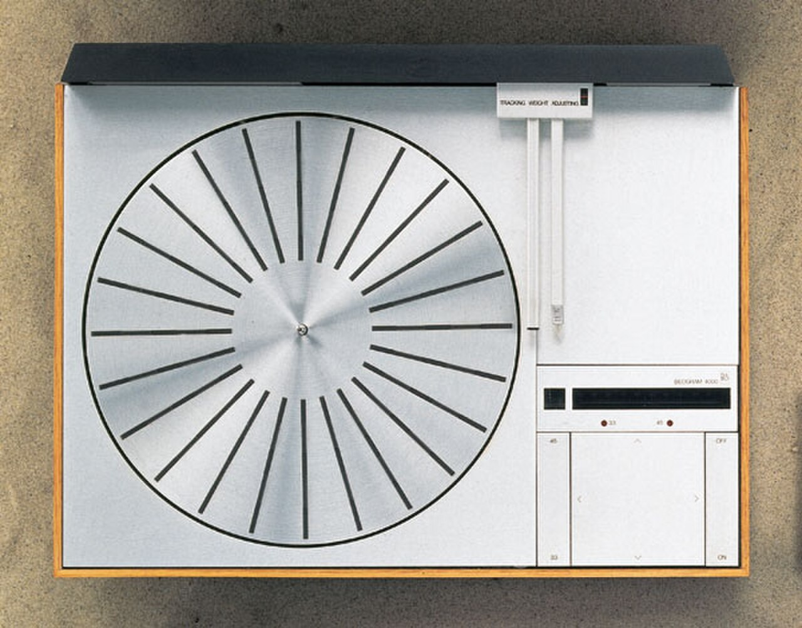 - CC BY-SA 3.0. Bang & Olufsen Beogram 4000, credited to Jacob Jensen Holding, Wikimedia Commons (File:B&O Beogram 4000.jpg).

A linear-tracking turntable for Bang & Olufsen. The tonearm travels straight across the record rather than swinging through an arc, so the arm carriage and the operating controls sit flush in a narrow aluminium strip alongside the platter rather than standing above it. Aluminium and rosewood, one finish across the whole face. It won the iF Design Award in 1972 and entered the MoMA design collection in 1973. A working surface splits into an output field and a parallel control strip, both flush on one plane and aligned to a single axis, so the whole face reads as one flat surface.

**Rationale.** The tangential arm holds the stylus at the constant angle the cutting lathe used, removing the tracking-angle error a pivoted arm accumulates across the record and letting the whole carriage lie flush in a strip beside the platter instead of swinging above it. That geometric correctness and the flat single-plane face are bought with a servo system of real complexity: two arms under electronic position control and a precision iron-free motor turning a lead screw, one of the most expensive parts in the machine. It optimises for correct groove geometry and a level surface and gives up the simplicity, low cost, and easy serviceability of an ordinary pivoted arm.

**Directive.** Split a control surface into an output region and a control strip on one shared axis, both at the same elevation, with one clean boundary between them: a `Pane.Header` or `DataTable` toolbar over `Pane.Body`, or a `Grid` that sets the controls in a strip beside the data. Align every control to the `--sf-unit` grid so it reads level with the surface rather than stacked on top of it. Hold one finish across the plane: a single `--sf-color-bg`, a single `--sf-color-border`, sharp `--sf-radius-default` at 2px, no nested cards. Keep the resting surface at `--sf-elevation-0` or `1` and spend elevation only on a genuine layer, so the panel stays one plane.

### Bang & Olufsen Beomaster 1900 (1976, Jacob Jensen)

No freely licensed image available. Contemporary Beomaster 1900 photographs on Beoworld and Beocentral are copyright of their photographers; the model is documented in the V&A collection (item O321483) and at MoMA. The directive is derived from those references.

An FM receiver and amplifier with a flat front face and no protruding knobs. The controls used often (power, volume, source, the five preset stations) respond to light contact on the flat aluminium face through B&O's sensi-touch system. The controls set once and then left (station tuning, bass, treble, balance, stereo select) sit under a full-width aluminium lift-up lid. Each setting shows through the closed lid as a thin lit dash that lights only where a value is set. Frequent controls stay on the calm face and set-once controls hide under a lid, so the resting panel shows only what is active.

**Rationale.** Jensen divided the controls by how often they are used, aiming the receiver at a wide audience who wanted music rather than hi-fi equipment: everyday functions answer a light touch on the flat aluminium face while the set-once functions hide under the lid, so the resting panel shows only what is active. This buys a calm, approachable single plane at the cost of tactile feedback, since a sensi-touch plate offers no detent or knob position to feel, and it puts the occasional controls a lid-lift away, slower to reach and lower in discoverability. It also accepts a middle-market position, forgoing the facilities and ultimate quality of a true high-fidelity receiver to reach the larger audience.

**Directive.** Split controls into a primary set on the resting surface and a secondary set behind a disclosure. Put frequent actions on the face (a `Pane.Header` toolbar, a `MenuBar.Control` row, a `ToggleGroup`) and fold the set-once controls into a `Drawer`, `Popover`, or `Reflow` accordion that opens on demand. Keep the resting panel quiet: no badges, no notification dots, `--sf-color-primary` only on the active or focused control and neutral `--sf-color-border` everywhere else. Where a value is set, surface it as a small `--sf-font-mono` readout (a `Chip` with a `dot`) that appears only once set, echoing the lit dashes, rather than a permanent row of always-on controls.

### Bang & Olufsen Beomaster 901 (1972 to 1977, Jacob Jensen)

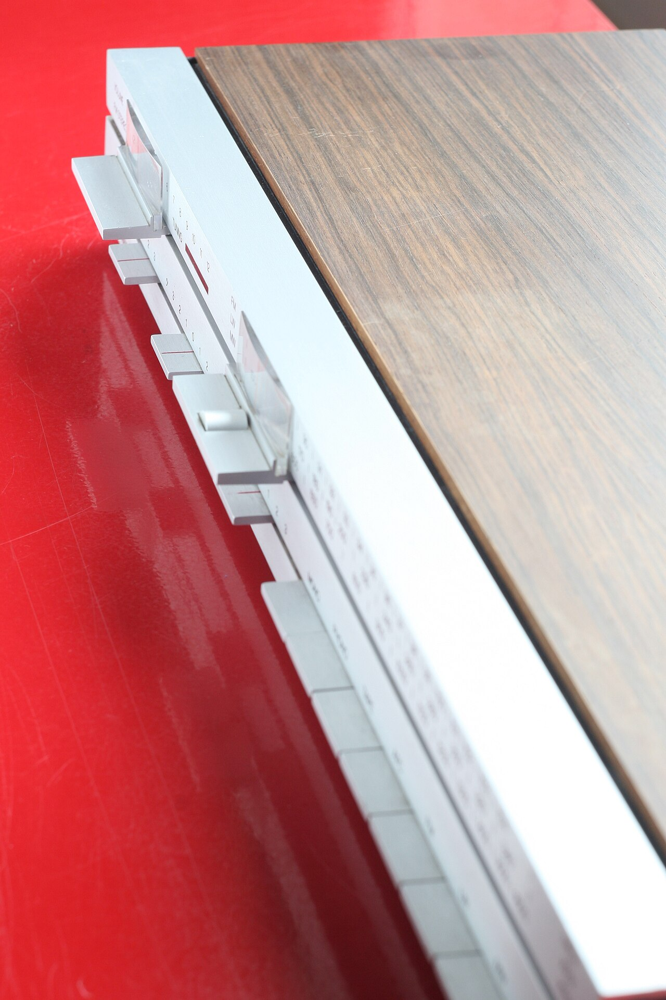 - CC BY-SA 3.0. Photo by Petri Krohn, Wikimedia Commons (File:Beomaster 901 C1735.jpg).

A compact aluminium-and-rosewood receiver. Volume, balance, bass and treble run as inline sliders along one horizontal axis; waveband and input selection are slim flush push-buttons on the same line. One material, one finish, every control on a single baseline. A control cluster reads as one calm plane when every control shares an axis, a height, and a finish, with alignment supplying the order and no boxes around groups.

**Rationale.** Running volume, balance, bass and treble as inline sliders on one baseline lets the whole setting read at a glance, because a slider shows its value by absolute position rather than the relative angle of a knob, and one finish across the bar makes alignment carry the order without any boxes. The cost is mechanical and long-term: slide potentiometers were not made in the length the layout wanted, so cord drives run them internally, and the open slots between the aluminium bars admit dust to the pots over years of use. Holding every control to one shared axis, height and finish also forgoes physical hierarchy, so no single control can dominate by size or feel and order comes only from position and spacing.

**Directive.** Lay a settings row on one shared baseline aligned to the `--sf-unit` grid rather than boxing each group. Zone by spacing and weight, keeping one `--sf-color-border` on the outer frame and none inside. Hold one finish: a single `--sf-color-bg` and one control height across the row. Compose the row from `FieldLayout` fields with a `ToggleGroup` and a `ButtonGroup` that share a cascading `size`, so a bar of related controls reads as one continuous surface rather than a set of separate widgets.

### Bang & Olufsen Beogram 2402 (early 1980s, Jacob Jensen)

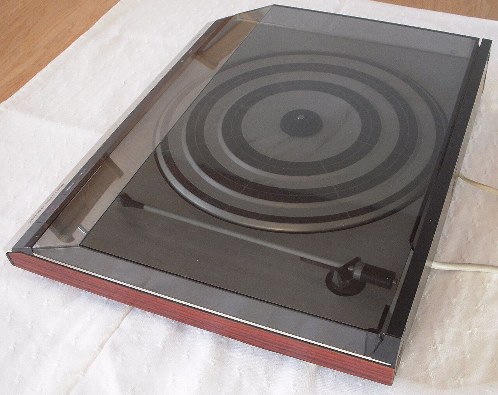 - CC BY-SA 3.0. Photo by user BKP, Wikimedia Commons (File:BEOGRAM 2402 02.JPG).

A later linear-tracking turntable. A single flat lid covers the platter and the tangential arm, and the plinth carries flush controls in one aluminium finish. Closed, the object reads as one uninterrupted plane; the mechanism appears only when the lid is raised. The resting object stays one calm, uniform plane, and the complexity stays available without being on display.

**Rationale.** Making the deck fully automatic and operable with the dust lid shut lets it rest as one uninterrupted plane and protects the record: the user presses start and the integrated mechanism does the rest. It optimises for a calm, sealed surface and light-touch use, and gives up the hands-on control of an exposed manual deck, with no manual cueing and the working parts left enclosed and hard to reach for adjustment or mid-play intervention. Full automation also carries servo and logic that a bare manual platter does without, added cost and failure surface in exchange for the untouched face.

**Directive.** Present a complex region as one uniform surface at rest and reveal its machinery on demand. Hold one finish across the whole surface (one `--sf-color-bg`, one `--sf-color-border`, sharp `--sf-radius-default` at 2px) and put the working detail behind a `Fullscreen` toggle, a `Drawer`, or a `Dialog` that opens when needed, or a `DataTable` toolbar and `Graph.Controls` that stay collapsed until the user engages. Treat the reveal as a state with a `--sf-duration-base` transition under `--sf-ease-out` and a `prefers-reduced-motion` static fallback, and let the surface return to one plane when closed.

---

## 13. Mechanical and segmented readouts: a grid of character cells, each digit stepped or lit into place

The fixed-cell readout as an instrument: a grid of character positions, each digit stepped or lit into place and held at full contrast.

### Solari di Udine split-flap departure board (1956 onward)

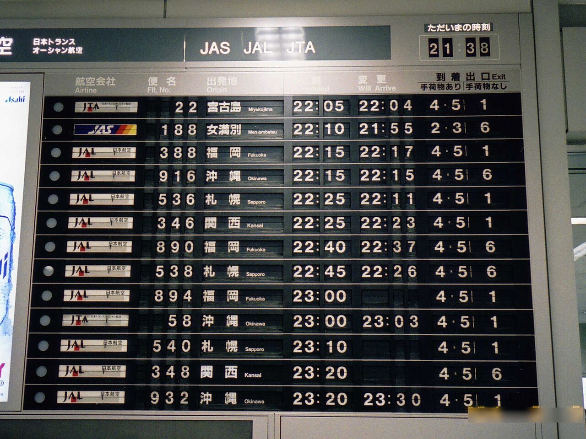 - Public domain (photo Cassiopeia sweet, 2003, Tokyo/Haneda arrival board), Wikimedia Commons.

A departure board built from rows of fixed cells, each holding a stack of hinged flaps printed one character per leaf. To show a value the drum turns and flaps fall until the target character seats face-up, with the familiar clatter as the intermediate leaves pass. Every cell has the same capacity and the same alphabet, so a change is a step through that alphabet until the character locks into place. The board reads as a grid of identical character positions, and the whole schedule scans in aligned monospace columns. Solari sold its first moving board to Liege station in 1956 and thousands more to airports and railway stations through the 1990s. A readout is a grid of fixed-capacity cells, and a value arrives by stepping a cell through a fixed alphabet until the character locks in.

**Rationale.** The principle is a whole preprinted glyph carried on a physical leaf, positioned by a drum that steps through a fixed alphabet under one small motor per cell, so every character shows at printed full contrast and the board draws power only during a change. This optimises legibility at distance, near-zero standby energy and reliability over decades. The cost is that the drum turns one way only, so reaching a target cycles through every intermediate flap, which makes updates slow and audibly clattering; the alphabet is frozen at manufacture (a cell can only show a character someone printed on a leaf); and the moving parts wear and need specialist maintenance.

**Directive.** Model numeric entry as fixed cells that a digit seats into. In `DigitInput` "push" mode keep each digit a fixed tabular-numeral cell on the `--sf-unit` grid, and let a committed keystroke settle with one `--sf-ease-snap` overshoot at `--sf-duration-fast` so the character locks like a fallen flap rather than fading in. Give any live readout a fixed-width box so digits hold their pixel position as the value changes; let the surrounding scale or label move. Set schedules and logs (a `DataTable` time column, `StreamingTerminalText`) in aligned `--sf-font-mono` columns so the field reads as one grid of cells.

### Nixie tube numeric display (1955 to late 1970s)

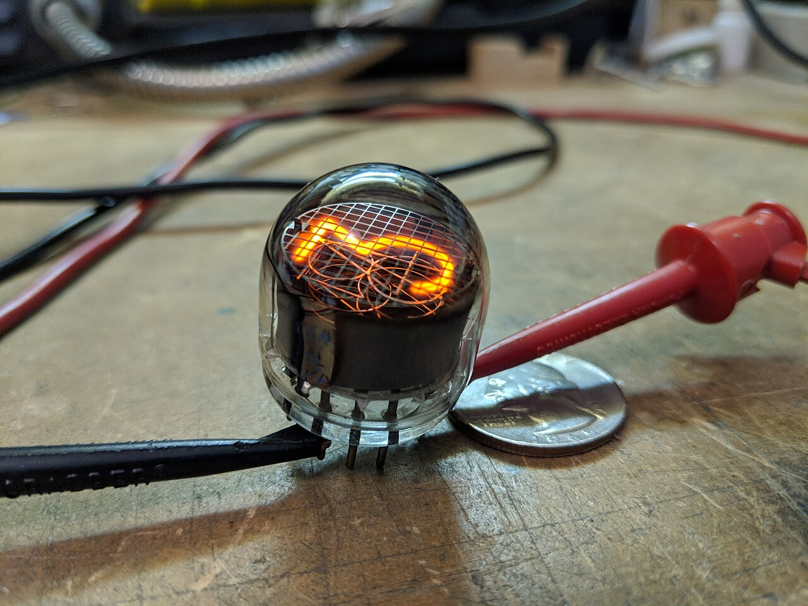 - CC BY 4.0 (photo TubeTimeUS, 2018), Wikimedia Commons.

A cold-cathode tube holding ten cathodes, each shaped as a complete numeral zero to nine and stacked front to back. Voltage on one cathode makes it glow with an orange neon discharge, so the lit figure is a whole character rather than a reconstruction from parts. Because the numerals sit at slightly different depths, the glowing digit reads with real presence against the dark glass. Each tube is one cell, and a multi-digit readout is a row of identical tubes. Nixies drove instrument panels, frequency counters and early desktop calculators before seven-segment LEDs displaced them. An emissive character on a near-black field is the most legible numeric readout, and one hue against darkness is enough to carry it.

**Rationale.** Each numeral is a complete shaped cathode, so lighting one glows the entire figure as a solid neon character rather than assembling it from parts, and stacking the ten cathodes front to back gives the digit real depth. This buys a warm, genuinely shaped, high-legibility digit on a dark field. The costs are steep: only one cathode lights per tube while the other nine ghost faintly in front of or behind it at different focal planes, giving parallax; the discharge needs roughly 170V that 5V logic cannot supply directly; and the cathodes suffer poisoning and wear that cap the tube's life. It trades character and presence for high voltage, depth artefacts and a numerals-only repertoire.

**Directive.** This is the dark-theme reading of a numeric readout. Under `[data-theme="dark"]` keep the field near-black and let the digits carry the contrast at full-strength `--sf-color-fg` in `--sf-font-mono` tabular numerals, so a `DigitInput` or a `DataTable` metric cell reads as a row of lit tubes rather than a boxed-in form. Reserve saturated colour for a genuine state, a `--sf-color-warning` caution or a `--sf-color-danger` limit on the specific digit or cell that crosses it, and keep resting digits neutral. Lean on the dark-mode lit-edge elevation model so the working edges catch light rather than surface fills being raised.

### Seven-segment LED display (1970s onward)

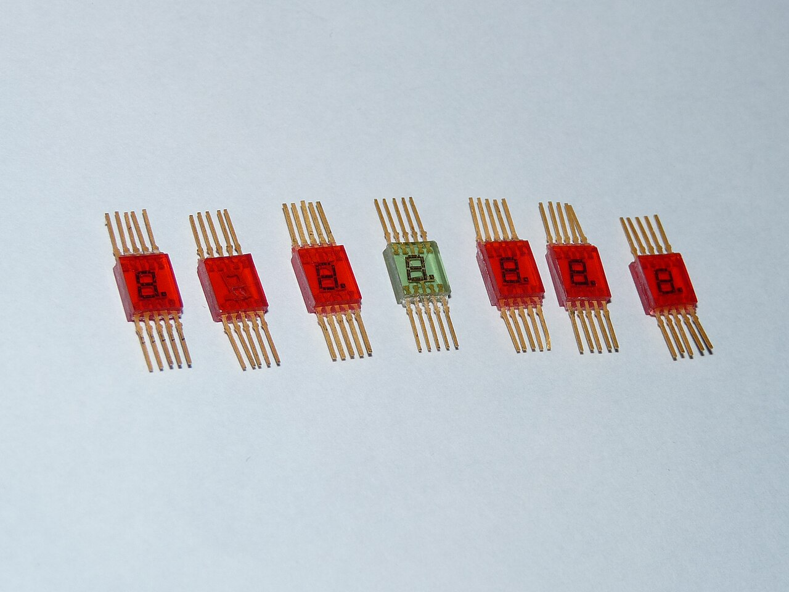 - Public domain, PD-self (photo Dmitry G), Wikimedia Commons.

A character built from seven bar segments in a figure-eight, plus a decimal point, each segment an addressable LED. Lighting a subset draws a digit, and the fixed seven-segment geometry is the entire alphabet the cell can render, which is why the numerals carry their distinct angular shape. The unlit segments stay faintly present as dark bars, so the ghost of a full "8" sits behind every digit and marks the cell's capacity. High-contrast red or green segments on a black face made these the readout of calculators, clock radios, instrument panels and lab gear. The character is reconstructed from a fixed segment grid, and the idle segments stay visible as a placeholder that shows the cell's full extent.

**Rationale.** The principle is to reconstruct a digit from seven straight bars, the minimum geometry that draws 0 to 9, so a cell needs only eight addressable lines and a multi-digit readout drives cheaply by multiplexing shared segment lines. This optimises part count, driving cost and bright high-contrast output. The price is expressive range: seven straight bars form no curves or diagonals, so the renderable alphabet is essentially the ten numerals plus a few hex letters, the angular numeral shapes are a compromise the geometry forces, and any richer text demands a costlier dot-matrix display.

**Directive.** Use the unlit-segment ghost as the model for placeholder capacity. `DigitInputMicro` already shows faded, dithered slots (░░ ░░) at rest and fills them left to right; keep those rest-state slots visible at `--sf-color-muted` so the field advertises its extent the way the dark bars of an idle seven-segment cell do, rather than collapsing to a blank box. Keep filled digits full-strength `--sf-color-fg` in `--sf-font-mono` tabular numerals over the recessed `--sf-color-input-bg` slot, so the contrast between a set digit and its ghost reads at a glance.

### Reflective seven-segment LCD (1970s onward)

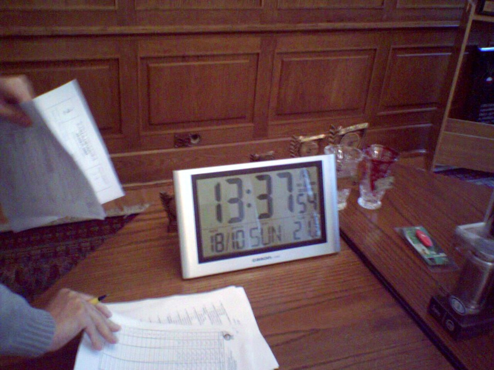 - CC BY 3.0 (photo badsanta23, 2010), Wikimedia Commons.

A passive display where each segment is a liquid-crystal cell that, when addressed, twists to block ambient light and turns dark against a grey or grey-green reflective background. It emits nothing and draws almost no power, so the same figure-eight seven-segment grid reads by daylight on a wristwatch, a multimeter or a bench clock. The unlit segments stay permanently faintly visible as the ghost of a full "8", and the readout is calm and low-contrast rather than glowing. The same cell reads by reflected ambient light as dark figures on a pale field, the light-theme counterpart to the emissive tube, with the idle segments always present as a quiet placeholder.

**Rationale.** The principle is a passive twisted-nematic cell that modulates ambient light rather than emitting it, twisting reflected light through crossed polarisers and blocking it to darken a segment. This optimises for battery life, since the cell only switches the field and lights nothing, and for daylight, where more ambient light means more contrast, so it stays readable in direct sun where emissive displays wash out. The cost is that it produces no light of its own, so in darkness it needs a separate frontlight to be read at all, and reflective cells give lower contrast, narrower viewing angles and slower switching than a glowing readout. It buys years of runtime and sunlight legibility at the expense of self-illumination and crispness.

**Directive.** This is the light-theme reading of the same cell. Under the default theme render digits as dark `--sf-color-fg` figures on the recessed `--sf-color-input-bg` field, calm and low-contrast, matching reflected light rather than a backlit glow. Carry the ever-present ghost segment through as `DigitInputMicro`'s rest-state placeholder slots at `--sf-color-muted`, and keep the readout quiet: no accent on a resting value, `--sf-color-primary` only on focus. Pair this with the emissive dark-theme reading above so a single `DigitInput` swaps between the two by token under `[data-theme]`, never by branching on theme in JS.

---

## 14. Siemens industrial control: one modular grammar from the DIN rail to the operator screen, colour spent only on a real fault

Siemens process and machine control builds from one repeated module, prints each unit's identity where the hand works, stages entry before it commits, and lights colour only on a genuine fault, holding the same grammar from a single DIN-rail block to a plant-wide mimic wall.

### SIMATIC S7-300 rack on a DIN rail (1994 to 2023)

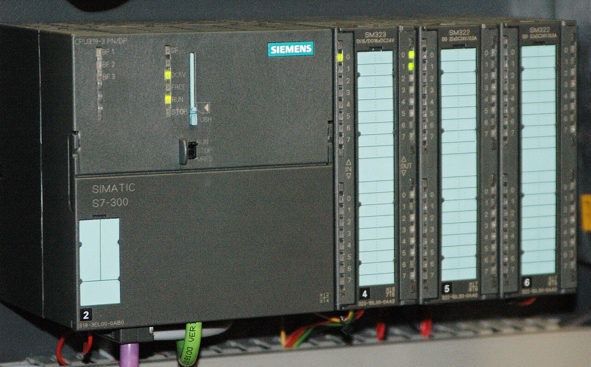 - CC BY-SA 2.5, photo Ulli1105, Wikimedia Commons.

A programmable controller assembled from modules snapped onto one shared DIN rail. The CPU sits at the left with a vertical status-LED strip (SF, BF, DC5V, FRCE, RUN, STOP) and a keyed mode switch; identical-width signal modules follow, each carrying its own vertical strip of channel LEDs, a light hinged terminal cover, and a slot number printed at the foot. Every module is the same height and hangs on the same rail, so the whole assembly reads as one repeated grid. The bodies are matte anthracite and the only colour is the lit LEDs: green for channel state, with the SF system-fault LED held red at the top of each strip and dark until a real fault. Density comes from repeating one module footprint, so the eye learns the slot once and reads it across the cabinet, and the RUN/STOP selector on the CPU stays visible at all times.

**Rationale.** The controller is built from one repeated module footprint on a shared rail and backplane bus, so I/O grows by snapping on another block, any module swaps out in the field, and each module reports its own channel state on its own LED strip with the SF fault light dark until a real fault. This optimises for serviceability and fast fault localization: an installer learns the slot once and reads it across the cabinet, and the LED names the failed module before a programmer is connected. The cost is that the uniform envelope and the backplane (connectors, fixed module width, unused cells) spend space and money against a purpose-built board, so the discipline pays only above a certain channel count; and because addresses derive from the physical slot, rearranging modules can shift I/O addresses and break the program.

**Directive.** Compose a dense control surface as a uniform `Grid` of modules sharing one footprint on `--sf-unit` tracks, so a `DataTable` or `Explorer` row, a form section, or a panel column is one repeated slot the eye learns once. Give each module a single status strip and keep its body neutral (`--sf-color-fg`, `--sf-color-border`), spending `--sf-color-danger` only on a genuine fault the way the SF LED stays dark until a real system fault (a `Chip` with a `dot`, neutral at rest). Keep the current mode named and visible on the controlling module with a `ToggleGroup` rather than buried in a menu, echoing the always-visible RUN/STOP switch.

### SIMATIC S5 PG 675 luggable programmer (early 1980s)

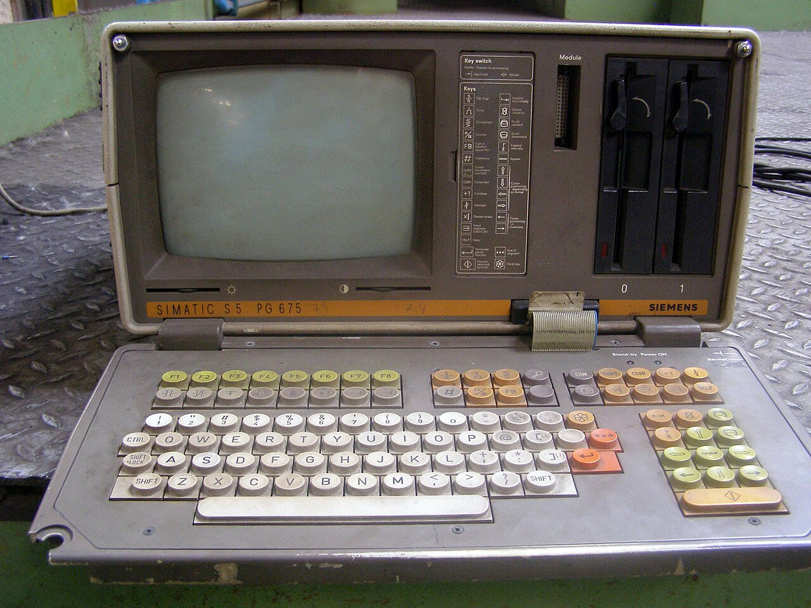 - CC BY-SA 3.0 / GFDL, photo Mixabest, Wikimedia Commons.

The portable programming device for the SIMATIC S5 controller family. A flip-up alphanumeric keyboard with eight function keys, a 23 cm monochrome CRT, two 5.25-inch floppy drives and an integrated EPROM programmer fold into one rugged case of roughly 17 to 20 kg. It ran CP/M and loaded the STEP 5 software from a system diskette. An engineer carried the whole authoring workstation to the machine, wrote and tested the control program on the factory floor, then wrote it into the controller. The display, keyboard and storage pack into one self-contained instrument that shows its own state and needs nothing else to do the job; a small monochrome screen and a fixed key bank are sized for the task and legible under shop lighting.

**Rationale.** The whole authoring workstation (CRT, keyboard, dual floppies, EPROM burner) folds into one rugged self-contained case so the engineer carries it to the machine and runs the write, test and burn loop next to the running process, depending on no ambient setup. It optimises for on-site commissioning where the signals actually are, robust under shop conditions. The cost is weight: self-containment means 17 to 20 kg of luggable bulk and a full workstation duplicated for field use, and the small monochrome CRT and fixed key bank sized for the task cap the working area and resolution.

**Directive.** Design a region as a self-contained unit that carries everything the task needs and depends on no ambient chrome: a `Pane` (header plus scrollable body) or a `WindowArray` column holding a complete working context, so it stays usable dropped into a sidebar or a split. Give function keys fixed, learnable homes: a `MenuBar.Control` strip or a `ButtonGroup` whose actions keep their position, each labelled in `--sf-font-mono` and tagged with a `Kbd` keycap driven by a central hotkey engine (`focusFieldHotkey`). Build for the small dense screen first: full-strength `--sf-color-fg` on the field, tabular mono figures, and no layout that assumes a wide viewport.

### STEP 5 ladder, statement list and function block editor (late 1970s to 1990s)

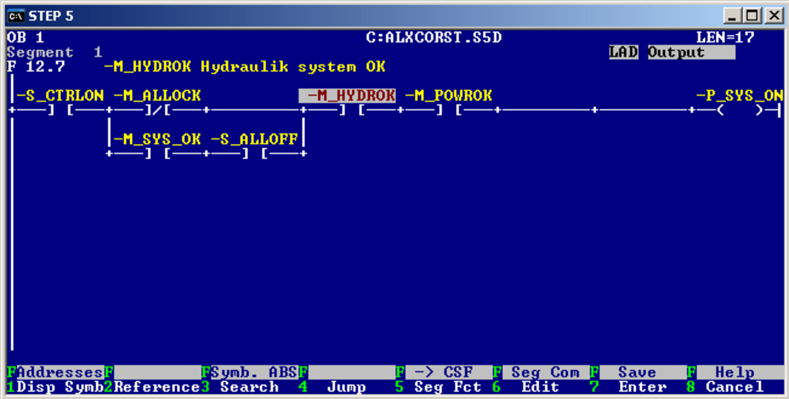 - CC BY-SA 4.0, author Alxcor, Wikimedia Commons.

STEP 5 authored the logic for S5 controllers in three interchangeable representations of one program: LAD (contact plan, a ladder of contacts and coils), STL (statement list, a text of boolean instructions) and FBD (function block diagram, gates wired into blocks). The editor rendered each on a fixed character grid, one network per segment, and switched a translatable block between the three views. Programs were built from named, typed blocks (organization, program, function, data) rather than one long listing. The logic is a single structure the author reads as a wiring diagram, as text, or as gates, each view generated from the same source; the grid seats contacts and coils in fixed cells, so a rung scans left to right like a circuit and the eye learns one template.

**Rationale.** One program generates three interchangeable views from the same source (ladder for the electrician, statement list for the programmer, function-block diagram for signal logic) on a fixed character grid of named typed blocks, so each trade meets the logic in a familiar form and a block round-trips between views. It optimises for shared authorship across trades and for circuit-like left-to-right readability. The cost is that only the common subset interconverts: statement list is a superset that manipulates the accumulator directly, and loops, indirect addressing and arithmetic have no graphical equivalent, so a block using them shows only as text and the promise of three views of one thing narrows to a lowest-common-denominator language for the graphical forms.

**Directive.** When one underlying model has more than one useful representation (a query as builder or text, a rule as form or expression), offer them as `Tabs` over the same source and generate each view rather than storing them apart. Lay any diagrammatic logic on a strict `Grid` of `--sf-unit` cells so elements seat in fixed positions and the path reads left to right, and keep the wiring explicit with `Graph`'s visible, editable edges rather than a hidden config. Render statement lists and code in `CodeEditor` (block caret, `--sf-color-code-*` themes), and give a block-structured program a navigable spine with `Explorer` or a `Minimap` keyed to the named blocks. Keep every legend and operand full-strength in `--sf-font-mono` with `font-size-adjust: var(--sf-font-mono-adjust)`.

### SIMATIC HMI Basic Panel running a live process screen (second-generation Basic Panel, photographed 2019)

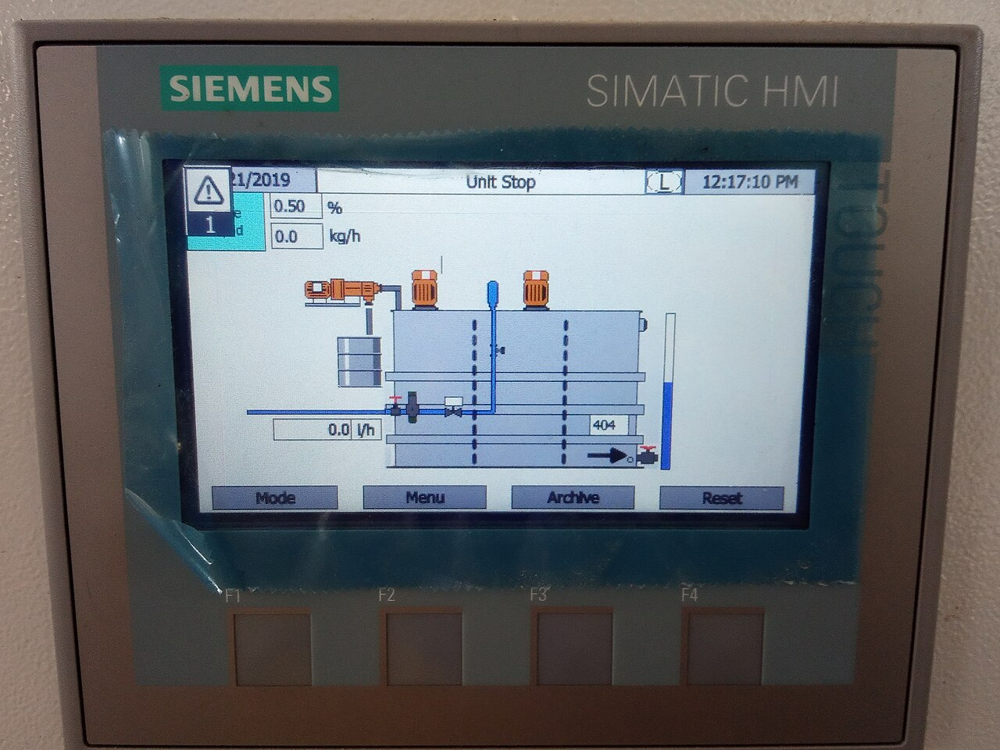 - CC BY-SA 4.0, photo ZianMan, 2019, Wikimedia Commons (File:SIMATIC HMI.jpg).

A small SIMATIC HMI touch panel (a KTP400-class Basic Panel, about 4 inches, four hardware function keys F1 to F4 in the bezel below the display) mounted in a machine and showing a running process. The screen holds a persistent header line: date at the left, the current machine state ("Unit Stop") in the centre, a login indicator and the clock at the right. An alarm field sits at the top left, a warning triangle carrying the active-alarm count beside two labelled value fields (0.50 %, 0.0 kg/h). The body is a high-contrast mimic: a tank with two pumps, a dosing pump, valves and pipes drawn as flat schematic symbols in one line weight, a vertical level bar, a flow readout and a batch number in fixed fields. A row of four on-screen softkeys (Mode, Menu, Archive, Reset) sits directly above the four hardware keys, so each label names the physical key beneath it. The whole operator-screen skeleton reads in one artifact: a status and alarm line that never moves, values in fixed labelled fields, a schematic mimic carrying the process state, and a softkey frame binding on-screen labels to fixed physical keys.

**Rationale.** This follows the high-performance HMI discipline (ISA-101, the ASM Consortium): a grayscale mimic at rest, a status and alarm line that never moves, value fields in tabular figures, and colour spent only on an abnormal condition. It optimises for anomaly detection and muscle memory, because the operator scans for the absence of colour as proof all is well, so a fault is the only colour on the screen and nothing reflows under the hand. The cost is that the restraint reads as dull and unfinished to people expecting a colourful synoptic, so it meets initial operator and engineer resistance and needs training before grey registers as healthy; it gives up the literal realism of a pictorial mimic, and the small low-resolution panel caps how much the fixed-field skeleton can carry.

**Directive.** Give every app a persistent status strip in a fixed `Pane.Header` slot that spells the current mode in words plus the clock and never reorders. Set value readouts as `DigitInput` or `DataTable` cells in `--sf-font-mono` tabular figures with `font-size-adjust: var(--sf-font-mono-adjust)`, so digits seat in fixed boxes and never reflow as they change. Draw any process mimic as flat schematic marks (a `Graph` or rendered symbols) at one line weight on a neutral field, with no gradients. Reserve the alarm indicator for a real condition: `--sf-color-warning` for an awareness caution and `--sf-color-danger` for an action-required hazard, absent at rest, with the count and message routed through a status region or `NonIdealState`. Fix action controls to a frame with a `ButtonGroup`, labelling each in place and echoing the binding as a `Kbd` keycap rather than a distant legend.

### SINUMERIK operator panel front: the softkey frame and machine keypad (monochrome-CRT era, 1980s to 1990s)

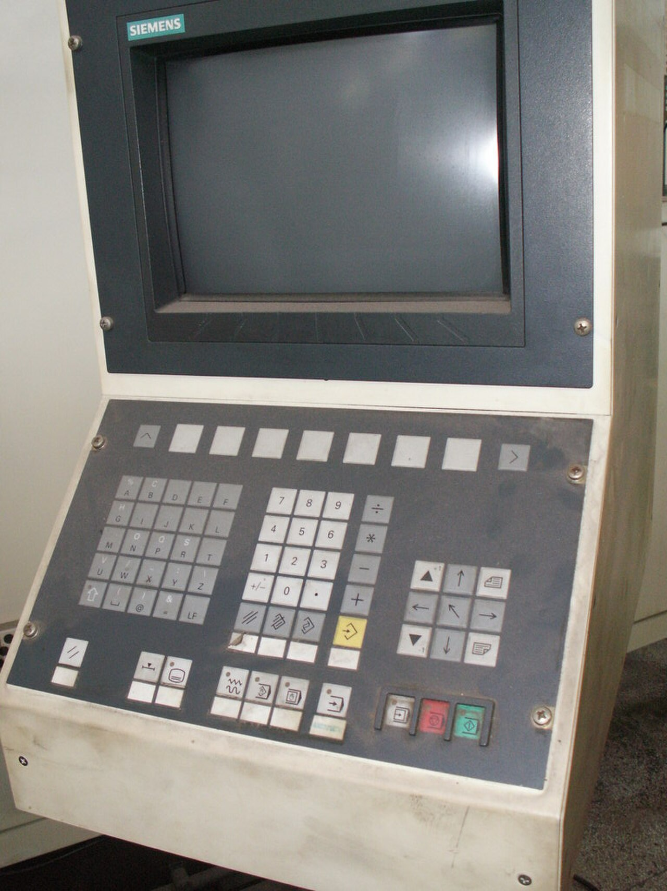 - CC BY-SA 2.0, photo Carlos Vieira (Brazil) via Flickr, Wikimedia Commons (File:CNC panel.jpg). Distinct from the section 9 SINUMERIK image by the same photographer.

The operator panel front of a Siemens SINUMERIK CNC, the man-machine communication (MMC) frame that section 9 only sketches. A monochrome display sits in a steel bezel over a row of unlabeled softkeys that take their meaning from the screen labels directly above them, flanked by a recall key and a menu-extend key that page the softkey set. Below sit an alphanumeric block for editing G-code blocks, a DIN-standard numeric keypad (7 8 9 / 4 5 6 / 1 2 3 / +/- 0 . with arithmetic keys), a cursor and page block, and three committed-action keys set apart in the corner: a white RESET, a red stop, and a green cycle-start. One fixed frame of generic keys serves many functions because each takes its current meaning from the label on the screen beside it; the keys hold their positions and hit-targets while their bindings change with context, and the two paging keys walk the set. Committing an action is a separate deliberate key set apart from the editing keys.

**Rationale.** One fixed frame of generic keys covers a deep menu tree: unlabeled softkeys take their meaning from the screen label directly above, holding position and hit-target while their binding changes with context, two paging keys walk the set, and the committing keys (RESET, stop, cycle-start) sit apart in a corner. It optimises for a compact, sealed, cheap panel that survives coolant and chips and for muscle memory that carries across screens, keeping an accidental start away from an edit key. The cost is indirection: a key's current function is not self-evident from the hardware, so the operator must read the screen to know what it does and a novice is slower, and reaching a deep function means paging through softkey levels rather than pressing one dedicated labelled key.

**Directive.** Build a context-action surface as a fixed frame of equal `Button`s whose positions never move, rebinding only their labels and `onClick` from the active view rather than rebuilding a bespoke toolbar per screen. A `Pane` holds the working `Pane.Body` in the centre with two `ButtonGroup` rails at fixed edges (a bottom strip and a right strip on the `--sf-unit` grid), each key the same size and hit-target so muscle memory survives across contexts; page a longer set with a recall/more pair rather than reflowing the strip. Keep numeric entry a DIN keypad of fixed tabular-mono cells (`DigitInput`), fully keyboard-driven. Set the committing keys apart in their own corner away from the editing keys: a cycle-start maps to one primary `Button`, a stop to `Button variant="danger"`, so a commit is never adjacent to a data key. Legends stay full-strength `--sf-color-fg` in `--sf-font-mono`, never grey or hover-only.

### Mauell mosaic mimic panel: the process map built from a modular tile grid (1961 onward)

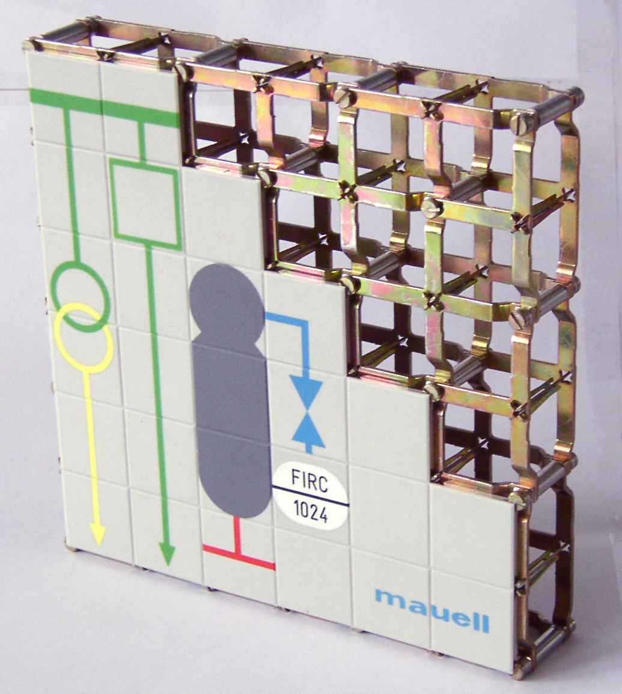 - CC BY-SA 3.0 / GFDL, photo Frank Ortmann (2004), German Wikipedia. Hosted on de.wikipedia with a Commons transfer pending copyright review; the file page carries both licences, so treat the URL as stable but flag the pending review.

A mosaic mimic panel assembled from small square plastic tiles on one shared grid (standard cells are 18, 24, 36 or 48 mm). Each tile carries a fragment of the plant schematic: a length of pipe, a valve symbol, a vessel, an instrument loop tag such as "FIRC 1024", colour-coded by the medium it carries. A self-supporting metal grid frame holds the tiles and lets a lamp, an edgewise meter or a switch drop into any cell, so the control-room wall becomes one schematic map of the process that every operator reads at once, and a plant change is a matter of pulling and replacing tiles. Mauell built these from 1961 and the schematic lines run continuously across the tile seams, so the grid supplies the alignment while the drawing stays free. Siemens process control of the same decades drove exactly this kind of mimic desk, and when screens arrived Teleperm M (1980) and SIMATIC PCS 7 (1997) rebuilt the discipline as on-screen faceplates, one standardized operator block per motor, valve or controller, called up on demand and read the same way every time.

**Rationale.** A self-supporting grid of standard tiles each carries one schematic fragment, with lamps, meters and switches dropping into any cell, so the wall becomes a single shared map every operator reads at once and a plant change is a matter of pulling and replacing tiles with no repaint and no shutdown. It optimises for shared situational awareness (one high-contrast overview legible across the room) and for reconfiguration on the fly. The cost is that it is a fixed physical artifact sized to the room, expensive and space-hungry, showing only what was built with no zoom, history or derived view; as plants grew more complex the on-screen faceplate (Teleperm M, PCS 7) displaced it, giving up the always-visible whole-plant glance a wall provides for pixels the operator must page through.

**Directive.** Build a process or pipeline schematic as a uniform `Grid` on `--sf-unit` tracks, each cell holding one fragment: a symbol, a value, or a status lamp. Route the connecting lines orthogonally across the cell seams with `Graph`'s editable edges at one line weight and one node marker, so the drawing stays continuous while the grid supplies the alignment. Reserve a small fixed palette to code the medium or series (a channel-to-colour map the operator learns once and sees identically everywhere) and stay neutral outside it; a resting line carries no `--sf-color-primary`. Keep instrument tags and values in `--sf-font-mono` tabular figures on the cell, and let a `Chip` `dot` or a lit cell show `--sf-color-warning` or `--sf-color-danger` only on a real condition. When the mimic moves on-screen, give a whole class of element one shared faceplate compound (a `Field` or `Box` with a fixed internal template) read the same way every time, and edit the diagram by swapping cells through props and tokens rather than reflowing the grid.

### Siemens miniature circuit breaker, printed class-and-rating marking (5SX2, 1990s to present)

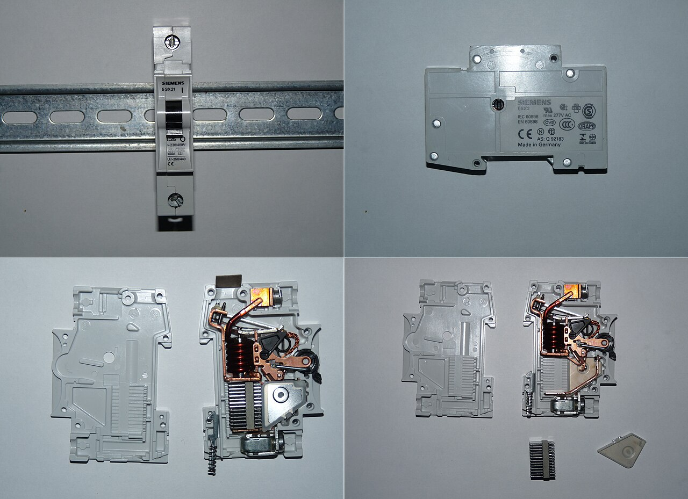 - CC BY-SA 3.0, photo Dmitry G, Wikimedia Commons.

A modular DIN-rail miniature circuit breaker, a Siemens 5SX2, the family the SENTRON line now continues. It clips onto the standard 35 mm rail at a fixed one-module width. The front face prints only what an installer needs where the toggle sits: the maker, the type, and the code C25, where C names the tripping characteristic (a class) and 25 the rated current in amperes. The side face carries the rest as a dense monochrome block: rated voltage, the IEC and EN standard numbers, the approval marks, Made in Germany. Colour codes nothing decorative; the identity of the device is the printed class-and-rating code, read the same way across a whole row of identical modules in a cabinet. The same discipline governs a SIRIUS contactor, whose terminals follow one fixed scheme (A1/A2 for the coil, 1 to 6 for the poles, 13/14 for an auxiliary contact) so any electrician wires it without a manual.

**Rationale.** The device's identity is compressed into a short standardized code (C25 = C tripping class, 25 A) printed where the toggle sits, the rest (voltage, standards, approvals) folded onto the side face, with one fixed terminal-marking scheme across the range, all governed by IEC 60898 so any maker's C25 behaves alike. It optimises for reading a row of identical modules apart by code at a glance and for wiring or swapping a unit without a manual or a vendor lookup. The cost is that the code is legible only to someone who has learned the convention (the B, C, D curves, the terminal numbers), so it is opaque to a layperson and depends on prior training; and pinning identity to a shared standard forbids per-vendor variation, trading self-description and brand distinctiveness for interchangeability.

**Directive.** Mark a repeated element the way these modules are marked: a short printed code that names its class and its value (C25), set in `--sf-font-mono` at full-strength `--sf-color-fg`, so a column of identical rows in a `DataTable` or an `Explorer` is told apart by its code rather than by re-themed chrome. Keep the marking monochrome and let colour code only a class or a state (a `Chip` with a `tone`: `--sf-color-warning` for tripped or at-limit, neutral at rest), never decoration. Fold secondary detail (standards, ratings, provenance) into the same module rather than a separate panel, the way the side face carries its standards block. Hold one fixed labelling scheme across the toolkit so a returning user reads any instance without a legend, taking standard terminal marking as the model for stable, learnable field and column names.

---

## 15. Meta-principles: what the whole lineage shares, mapped to our system

Seven principles run through every cluster. Each maps to a token or component behaviour we already have or should have.

### 1. The grid is the source of order, and it is invisible

From the 606 E-track to the Airbus fixed-screen deck to Gerstner's 58-unit substructure to the VT100 character cell: order comes from a shared modular grid that everything aligns to, felt but never drawn. The structure supplies the order, so arrangement is free to be asymmetric and content-driven.

**Maps to:** `--sf-unit` (1.5rem) as the single source, `--sf-leading-base` and `--sf-line-height-grid` locking block text to the baseline, and the `--sf-space-0..12` ladder only for non-unit fractions. Behaviour: `Grid`, `FieldLayout` and `Pane` derive every gap, height and inset from the unit; separation comes from alignment plus elevation and spacing, never a card border doing what alignment already does.

### 2. Less, but better: restraint as the discipline of subtraction

Rams's mandate, the Leica top plate with no mode dial, iA Writer with almost no settings, the Curta with one crank. Every element justifies its presence; whitespace and chrome are costs that must be earned.

**Maps to:** three type sizes (`--sf-font-size-sm` / `-md` / `-lg`, no xs/xl), one accent (`--sf-color-primary`), one structural border (`--sf-color-border`, with `-strong`/`-subtle` as aliases only). Behaviour: opinionated components with few props over configuration surfaces; the "strip it, ship the strip, add back only what proves necessary" check; density defaults over whitespace-as-luxury.

### 3. Honesty of function: show the mechanism, don't conceal it

The SK4 under glass, the T3 speaker grid exposed, the Pocket Operator's bare board, the Hasselblad film back that shows "12." A control should look like the thing it does, and the system should report its own state without a separate screen.

**Maps to:** the one sanctioned skeuomorphism (`Kbd` keycaps, the `inset 0 1px 0 rgb(255 255 255 / 0.18)` tactile top-edge cue on inputs/switches/buttons); text-entry controls resting one shade below the page (`--sf-color-input-bg`) and lifting to `--sf-color-bg` on focus so an empty field reads as a recessed slot. Behaviour: surface real state and real data (a live count, the actual query, the raw editable value); compound components (`Pane`, `Dialog`, `WindowArray`) as honest modules each showing its own state via a `Chip` `dot` or counter; explicit `Graph` edges over relationships hidden in a config dialog.

### 4. Tactile precision: quality is felt rather than decorated, through committed discrete feedback

The Curta's detent, the HP ENTER key, the Leica dial click: these read as high quality because of the decisive click of each control. On screen this is committed, discrete feedback, never springy or looping motion.

**Maps to:** `--sf-ease-snap` (`cubic-bezier(0.34, 1.7, 0.5, 1)`), the one sanctioned overshoot, reserved for a single deliberate interaction paired with `--sf-duration-fast` (120ms) and a single transformed property; the three durations (120/180/240ms) and `--sf-ease-out` / `-in-out`. Behaviour: tabular numerals seating into fixed cells in `DigitInput`; charts redraw and do not animate (no entrance tween, no eased zoom); `prefers-reduced-motion: reduce` with a static fallback everywhere; no bouncy springs on incidental motion.

### 5. Legibility for the glance, engineered for sustained attention

The PFD read under glare, the Porsche cluster read at speed, the Bloomberg screen read for forty hours a week. Fixed positions, high tick-and-numeral contrast, upright never-rotated labels, live values boxed and tabular while context scrolls behind them.

**Maps to:** `--sf-font-mono` with `--sf-font-mono-adjust` (0.52) so mono sits on the sans x-height; `--sf-color-gridline` (quieter than `--sf-color-border`) for chart scaffolding; full-strength `--sf-color-fg` for all body text. Behaviour: charts default to `scaffolding="hover"` with labels measured then thinned or ellipsized, never rotated, first and last always surviving; chrome hairlines snapped to the device-pixel grid while marks stay anti-aliased; live readouts in fixed-width boxes so digits never reflow.

### 6. Colour is a code: saturation reserved for meaning

The ET66 yellow "=", the Porsche redline, the Airbus green/cyan/amber/red state channel, the OP-1 knob-to-parameter mapping. A near-monochrome field is what makes the one signal legible. Multi-hue is licensed only as a fixed, learnable channel-to-colour code repeated identically everywhere.

**Maps to:** one accent `--sf-color-primary` (#2563eb light / #3b82f6 dark) for interactive and focused state only; reserved semantics `--sf-color-danger` / `-success` / `-warning`, each meaning something; everything else neutral. Behaviour: a resting control is never primary (blue appears only on focus/hover/checked); exactly two alert tiers (`warning` awareness, `danger` action-required), never a third decorative alert colour; no rainbow tag systems (`Chip` is neutral unless a `tone` makes the colour mean status).

### 7. Longevity over fashion: built to look correct in twenty years

The 606 shelf that still fits a 1960 rail, the 500-series body that ran 56 years, the Porsche layout unchanged across four decades, the VT100 grid still under every terminal, Bloomberg's pixel-for-pixel font. Stability of layout and contract is a feature: it preserves the returning expert's muscle memory.

**Maps to:** `--sf-radius-default` at 2px (the deliberately un-fashionable "hard pencil" corner), system-font `--sf-font-sans`, flat planes with no glassmorphism or gradients on chrome. Behaviour: extend through props and tokens, never fork a component; hold token names and the public `exports` contract stable across versions; absorb new capability into existing layout slots rather than reflowing the surface.

---

## 16. How this should show up in swiss-function

The fourteen directives below carry the lineage into practice. Each rests on a principle the exemplars share, is licensed by specific objects across the clusters, costs something we accept on purpose, and lands on named `--sf-*` tokens and components. Where a directive points past what the library ships today, it is marked as a design opportunity. Apply these when building and cite them in review.

### 1. Derive every dimension from `--sf-unit`

**Principle.** Order comes from one shared modular grid that everything aligns to, felt but never drawn, so arrangement stays free to be asymmetric and content-driven.

**Exemplars.** The 606 shelf hung from a wall-fixed E-Track, Gerstner's 58-unit substructure resolving into 1 to 6 columns, the VT100 character cell, the Mauell mosaic tile grid whose schematic lines run continuously across the seams, the SL 4000 channel strip repeated down the desk.

**Trade-off.** Snapping every gap, height and inset to the unit gives up bespoke placement: no element nudged a few pixels off the grid for local effect, and the work of choosing the substructure is front-loaded, since a poor unit constrains everything built on it (Gerstner's own warning). For a screen read for hours the alignment that results cuts search, so the constraint pays back daily.

**In the system.** `--sf-unit` (1.5rem) is the single source, with `--sf-leading-base` and `--sf-line-height-grid` locking text to the baseline and the `--sf-space-0..12` ladder only for non-unit fractions. `Grid`, `FieldLayout` and `Pane` derive every measure from it; separation comes from alignment plus elevation and spacing rather than a card border doing alignment's job.

### 2. Keep the accent for state

**Principle.** A near-monochrome field is what makes one signal legible, so saturation is reserved for meaning and a resting control carries none.

**Exemplars.** The Braun ET66's single yellow "=" among dark numerals and olive operators, the Porsche redline as the one saturated arc, the Airbus green/cyan/amber/red state channel, the OP-1's four fixed knob-to-parameter colours, the Siemens SF fault LED dark until a real fault.

**Trade-off.** Once colour means state it can do no other work: grouping, emphasis and decoration all fall to position, size and type, and the display stays austere. The commit signal rests on one hue and reads only once the user has learned it (the ET66 accepts that anonymity). For a tool worked daily the learning is paid once and a saturated pixel then always means something.

**In the system.** One accent `--sf-color-primary` (#2563eb light, #3b82f6 dark) for interactive and focused state only; `--sf-color-danger` / `-success` / `-warning` each carrying a fixed meaning; everything else neutral on `--sf-color-fg` and `--sf-color-border`. A `Chip` stays neutral unless a `tone` makes its colour mean status; a `Button` turns primary only as the one committing action in a row.

### 3. Two alert tiers, each paired with the next action

**Principle.** A resting field that shows nothing means nothing is wrong, so any lit element is worth acting on, and severity caps at two tiers that never merge mid-event.

**Exemplars.** The ECAM dark cockpit with red WARNING over amber CAUTION, the Airbus FMA naming the active mode in words plus one colour, the SIMATIC HMI Basic Panel's status-and-alarm line that never moves, the Chadburn handshake that treats an order as settled only when the reply pointer agrees.

**Trade-off.** Two tiers refuse nuance, forcing every intermediate condition up or down, and a quiet resting field asks the user to trust the absence of a signal (a dead indicator reads like a healthy one, which is why aviation mandates a lamp test). Pairing each alert with its scripted action can also let the user run the procedure without understanding the state (the reliance criticism after AF447). For a long shift the quiet field and capped severity keep workload low, which is worth those costs.

**In the system.** `--sf-color-warning` for an awareness caution that persists without interrupting and `--sf-color-danger` for an action-required hazard, never a third decorative alert colour and no badges when nothing is wrong; each message routes through `NonIdealState` paired with its next action. Design opportunity: the library has no persistent status strip and no two-tier alarm primitive. `Pane.Header` is only a slot today, so a dedicated status-strip component (a fixed mode line plus clock, an alarm field with a count, absent at rest) and an alarm discipline built on the two tones are worth adding.

### 4. Box and tabularize live values

**Principle.** A live number holds its pixel position while its context scrolls behind it, so digits never reflow as they change and the eye reads them by fixed place.

**Exemplars.** The Airbus altitude boxed against a scrolling scale, the HP Nixie counter's single in-line register, the Solari split-flap cells stepping a fixed alphabet, the Fluke 87 and 34401A primary readouts, the DSKY's signed five-digit registers that never change width.

**Trade-off.** A fixed-width box spends screen area on a value whose width rarely changes and caps how much fits on a small display (the MCDU's fixed grid trades an at-a-glance overview for a small glare-proof screen). We give up fluid, proportional number layout. For an instrument read under fatigue the steady position is what lets a value be read without re-parsing it, so the reserved area earns itself.

**In the system.** `--sf-font-mono` with `font-size-adjust: var(--sf-font-mono-adjust)` (0.52) and tabular figures across `DigitInput`, `DigitInputMicro` and `DataTable` cells so columns and registers align; the scale or trend moves, the number holds. Design opportunity: the mono entry controls are inputs, so a read-only display readout distinct from them (a fixed-width register that only shows a value, the Nixie or seven-segment cell as a display component) is missing and worth building.

### 5. Rank by decision-value

**Principle.** The metric the user acts on earns the optical centre and the largest type, so a surface is ranked by the weight of the decision each number carries rather than by convention.

**Exemplars.** The Porsche 356 tachometer dead centre while exact speed is demoted, the air-cooled 911 five-gauge fan with one dominant dial, the HP Nixie counter's one bright register above a matte control bank, the Fluke 87's one large number over a quiet bargraph.

**Trade-off.** Ranking for one task can misfit another: the Porsche premise holds on a track and inverts on the road, where the demoted speedometer is the number the law watches. Refusing to make every tile the same size also gives up a tidy uniform grid. For a focused professional tool the dominant readout is where the eye lands first, so the asymmetry is worth the loss of uniformity.

**In the system.** `Grid` reserves one fixed central primary-readout slot with `sm`-sized satellites around it, each value in tabular mono, the ground neutral. Design opportunity: there is no stat or metric cluster component; today a KPI row is hand-assembled from `Grid`, `Box` and `DigitInput`. A dedicated cluster (one dominant tile, ranked satellites, tabular readouts, semantic tone only on a threshold) would carry this directly.

### 6. Split surfaces into an output zone and a control strip

**Principle.** A working surface reads as one plane when it splits into an honest output region and a control strip across a single clean boundary, with dense clusters zoned by space and rule rather than boxed.

**Exemplars.** The Braun T3's drilled grille beside its tuning dial, the SK4 with every control on one right-hand strip, the B&O Beogram 4000's controls flush in a strip beside the platter, the HP 34401A's display left and task-zoned keys right, the Tektronix 465B's regions cued by tint and rule.

**Trade-off.** Zoning by spacing and a single rule gives up the instant "this is a group" a border draws around a card, so the reader learns the zones instead. And one dedicated control per function, the Tektronix ideal, does not scale, since each control spends irreplaceable area. For a surface read all day the calm of few rules and a learned layout beats the visual noise of nested boxes.

**In the system.** `Pane.Header` over `Pane.Body`, a `DataTable` toolbar over its body, or a `Grid` setting controls in a strip beside the data; zone clusters with `--sf-unit` spacing and one `--sf-color-border` rather than boxing each group. `Box` elevation and spacing carry separation before a border does.

### 7. Label adjacent, stage then commit

**Principle.** A label sits beside the control it names, and an edit to live data stages in one consistent place and reaches the field only on a deliberate commit, so a value is previewable and reversible before it takes effect.

**Exemplars.** The MCDU scratchpad line committed to a field by one line-select press, the DSKY verb/noun grammar keyed then settled on a single ENTR, the Chadburn order that counts only once acknowledged, the SINUMERIK soft key labelled where the finger lands.

**Trade-off.** Staging costs keystrokes: type-then-commit is slower than typing straight into a field, and only one value is in flight at a time (the MCDU accepts exactly this). For an edit that touches a live plan or a shared dataset the guarded, reversible commit is worth the extra gesture.

**In the system.** The `Field` compound and `FieldLayout` keep the label beside its control in strict source order; `DataTable` cell editors commit on an explicit action. Design opportunity: a scratchpad-style stage-then-commit for cell and bulk editing is not built in. DataTable commits per cell without a previewed staging line, and there is no command-bar primitive, so a stage-then-commit editing mode (a pending value echoed before it lands) is worth adding.

### 8. Keep the mono/sans split doing real work

**Principle.** Monospace marks anything the eye scans as data or input and sans carries running prose, a division that keeps columns aligned and near-identical glyphs distinct.

**Exemplars.** iA Writer choosing mono as the honest draft face, the VT100 character grid that lines up a directory listing, Bloomberg's pixel-stable mono held across decades, the Olivetti keyboards, the Nixie and seven-segment numerals.

**Trade-off.** Fixed-width type flows less naturally, since wide letters are cramped into the same cell (iA widened M, W, m and w into a duospace compromise), and mono reads optically larger, so it needs correction to sit on the sans x-height. Holding body text at full strength also gives up the quiet grey many reach for on secondary copy. For a data-dense tool the alignment and scan of mono, and the readability of full-contrast prose, are worth both.

**In the system.** `--sf-font-mono` with `font-size-adjust: var(--sf-font-mono-adjust)` for fields, code, tabular numerals and axis labels; sans for prose; body text always full-strength `--sf-color-fg`, never grey, with `--sf-color-fg-subtle` and `--sf-color-muted` kept to genuine secondary metadata.

### 9. Motion is a detent rather than a spring

**Principle.** On-screen feedback reads as quality through a committed, discrete settle, the way a precise control clicks into place, rather than through springy or looping motion.

**Exemplars.** The Curta's decisive crank detent, the HP-35 ENTER key, the Leica dial click, the Divisumma 18's volcano keys rising from one rubber skin under the finger.

**Trade-off.** Reserving motion for a single committing gesture gives up the expressive entrance and spring animation of consumer interfaces, and charts redraw without a tween. For a surface watched for hours, looping or bouncy motion fatigues and reads as decoration, so the restraint is the point.

**In the system.** `--sf-ease-snap` (`cubic-bezier(0.34, 1.7, 0.5, 1)`), the one sanctioned overshoot, on a single deliberate interaction with `--sf-duration-fast` (120ms) and one transformed property; the three durations (120/180/240ms) with `--sf-ease-out` and `-in-out`; a `prefers-reduced-motion: reduce` static fallback everywhere. `DigitInput` seats a digit like a detent; charts redraw rather than animate.

### 10. Dark mode is lit edges on near-black

**Principle.** At rest the field is near-black and only the working edges catch light, the way an instrument reads by a few specular highlights rather than by every surface being lifted.

**Exemplars.** The Leica M3 rim-lit against black, the Nixie digit glowing on dark glass, the BBC PPM's white scale on a black face, the ECAM overhead panel dark until a fault lights one button.

**Trade-off.** A control defined by a 1px lit rim is subtler than a filled, raised card and asks more of contrast and of the viewer, giving up the easy depth cue of a glowing surface. For long-session use the quiet field lowers glare and keeps the active control the one thing that catches the eye, which is worth the subtlety.

**In the system.** `[data-theme="dark"]` swaps token values rather than branching in JS: a zero-blur hard cast in the border colour, a faint lightening film only above elevation 1, and a 1px lit inset rim that brightens with level define controls; highlight brightness is reserved for interactive and focused elements; no glassmorphism and no gradients on chrome.

### 11. Compose from honest modules with visible seams

**Principle.** An interface is built from distinct modules, each owning one job, each separated by one structural seam and reporting its own state, so the system shows its condition without a separate screen.

**Exemplars.** The Hasselblad film back showing "12" at a bright seam, the SIMATIC S7-300 modules each with a channel-LED strip and a printed slot number, the Moog and SSL strips repeated across the wall, the Pocket Operator's bare board, the studio patchbay's visible cords.

**Trade-off.** A module that carries its full chain whether the source needs it or not is larger and costlier (every SSL channel holds the whole processing chain; the S7-300's uniform envelope and backplane spend space against a purpose-built board), and a visible seam gives up the unbroken single-surface look. For a serviceable tool the self-reporting module and the legible joint are worth the extra weight.

**In the system.** Compound components (`Pane`, `Dialog`, `WindowArray`, a `DataTable` whose data is the swappable back) separated by one `--sf-color-border`, each showing its own state through a `Chip` `dot` or a counter rather than a notification badge; `Graph`'s visible, editable edges draw a relationship rather than hiding it in a config panel.

### 12. Schematize node-link and route views

**Principle.** A network or route is drawn as a clean schematic, edges constrained to a fixed angle set at one line weight with one node marker, when the task is to trace a path rather than to mirror geography.

**Exemplars.** The Vignelli subway diagram at 0, 45 and 90 degrees with geography discarded, the Mauell mimic's schematic lines running orthogonally across the tile seams, the STEP 5 ladder seating contacts in fixed grid cells, the Moog patch and studio patchbay exposing every route.

**Trade-off.** Abstraction sacrifices correspondence to the world: the Vignelli map squared Central Park and evened the station spacing, so it was useless above ground and was retired after seven years. We give up geographic and physical fidelity for the legibility of the path. For tracing dependencies or flows the schematic read is what the user needs, so the fidelity is worth losing.

**In the system.** `Graph`, `Flows` and connector routing encode series identity by colour from a small fixed palette with a compact fixed legend; a resting edge carries no `--sf-color-primary`. Design opportunity: `Graph` today offers force, tree, radial, concentric and grid layouts but no schematic orthogonal (Manhattan) edge routing, so orthogonal-plus-45 routing that survives pan and zoom is worth adding for pipeline and mimic diagrams.

### 13. Treat the toolkit as the Unigrid

**Principle.** One fixed invariant chrome absorbs wide content variety and still reads as a single identity, so the constraint itself is the brand and coherence comes from removing per-instance styling rather than policing it.

**Exemplars.** The NPS Unigrid's black band and fixed Helvetica across hundreds of parks, the Solari board's frozen alphabet, the Siemens 5SX2 breaker read across a row by its printed C25 code under IEC 60898, the SINUMERIK soft-key frame holding position while its labels rebind, the MOCR consoles built to one identical format.

**Trade-off.** A fixed chrome forbids per-screen identity: each NPS park surrenders a distinct look, and local character lives in the photographs and words rather than the layout. We give up bespoke theming per view. For an app read across many screens the recognition and production economy of one chrome are worth the uniformity.

**In the system.** The invariant is the token set (`--sf-color-*`, `--sf-unit`, the three type sizes, 2px corners) plus fixed component chrome (`Pane.Header`, `Dialog` title and `Dialog.Handle`, `MenuBar`, the `DataTable` header), which should look identical across an app; a new look arrives as a prop within the system (`variant`, `size`, `tone`), never a per-screen re-skin or a fork.

### 14. Extend, never fork; hold contracts stable

**Principle.** Stability of layout and contract is a feature, since a returning expert's muscle memory and an old screen both survive an upgrade only if positions, token names and the public surface hold.

**Exemplars.** The 606 rail from 1960 that still takes a shelf bought today, the Porsche cluster unchanged across four decades with new data folded into existing dials, the VT100 grid still under every terminal, Bloomberg's pixel-for-pixel font, the Siemens SIRIUS terminal scheme (A1/A2 for the coil) that any electrician wires without a manual.

**Trade-off.** Backward compatibility is paid up front and constrains later change: the 606 committed to a solid wall, a poorly chosen contract limits everything built on it, and Bloomberg holds a dated look precisely so it never breaks a returning user's habit. We give up the freedom to redesign at will and the appeal of a fresh statement. For a tool measured in years of use the preserved muscle memory is worth the constraint.

**In the system.** New capability absorbs into existing layout slots rather than reflowing the surface; looks arrive as props (`variant`, `size`, `tone`); token names and the public `exports` contract stay stable, with the changeset and semver discipline (`just changeset`, `just release`) gating every version bump.
